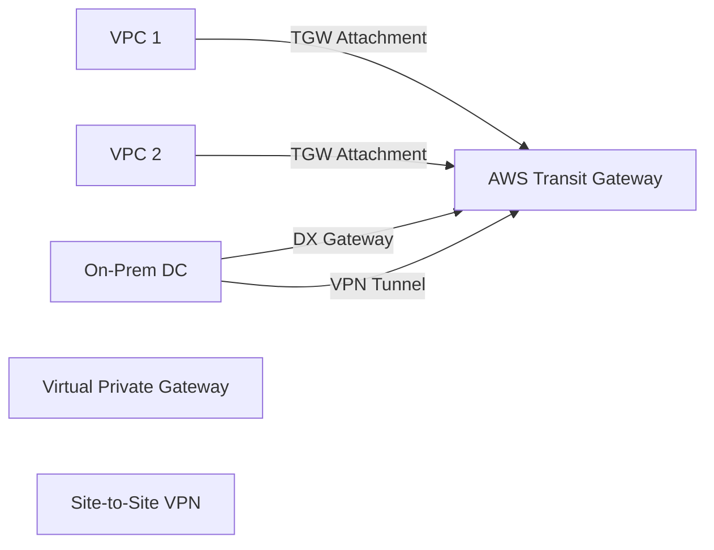
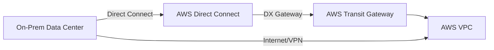
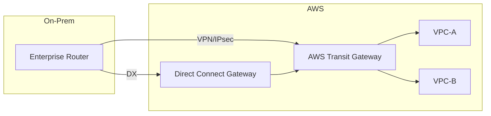
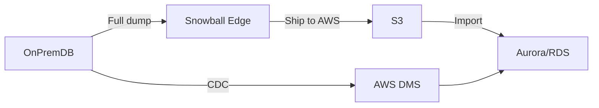

# Executive Summary  
In technical interviews, convey concise answers with confidence, clarity, and relevant examples. Emphasize AWS best practices and the *why* behind your choices (e.g. cost, performance, durability) rather than mere definitions. Interviewers look for structured explanations and evidence of experience; use the STAR method (Situation, Task, Action, Result) when possible. Tie answers back to real projects: “In my last project, I used [service/pattern] to achieve [outcome]” or mention quantifiable improvements (e.g. reduced latency, increased uptime). Always *ask clarifying questions* if a problem seems ambiguous. Speak with “I” and detail your role. Above all, reference AWS Well-Architected principles (security, reliability, performance, cost, operations, sustainability) to show you’re aligned with AWS guidance.

# Table of Contents  
1. Region vs AZ  
2. Shared Responsibility Model  
3. Scalability vs Elasticity  
4. Advantages of Cloud Computing  
5. CAPEX vs OPEX  
6. High Availability (HA)  
7. Fault Tolerance (FT)  
8. IaaS vs PaaS vs SaaS  
9. AWS Well-Architected Pillars  
10. Reserved, Spot, On-Demand Instances  
11. Spot Fleet and Diversified Allocation  
12. Auto Scaling Groups (ASG)  
13. Launch Templates vs Launch Configurations  
14. Nitro vs Xen Hypervisors  
15. Placement Groups (Cluster/Spread/Partition)  
16. EC2 Instance Lifecycle States  
17. Securing EC2 Instances  
18. IAM Roles for EC2  
19. EC2 Status Check Failures  
20. VPC Architecture  
21. Public vs Private Subnets  
22. Internet Gateway (IGW)  
23. NAT Instance vs NAT Gateway  
24. Security Groups vs NACLs  
25. VPC Peering Limitations  
26. AWS Transit Gateway  
27. Direct Connect (DX)  
28. Interface vs Gateway VPC Endpoints  
29. Route 53 Routing Policies  
30. Split-Horizon DNS  
31. Hybrid Cloud Networking  
32. Multi-Account Networking Design  
33. Overlapping CIDR Blocks  
34. VPC Packet Flow (to Internet)  
35. ALB vs NLB vs CLB  
36. Global Accelerator vs CloudFront  
37. Weighted Target Groups (ALB/NLB)  
38. Sticky Sessions (Session Affinity)  
39. ELB Health Checks  
40. Cross-Zone Load Balancing  
41. SSL Termination on Load Balancers  
42. Blue/Green Deployment Architecture  
43. Canary Deployment Patterns  
44. ALB 502/503 Errors (Troubleshooting)  
45. EBS vs EFS vs S3  
46. S3 Transfer Acceleration  
47. S3 Consistency Model  
48. S3 Lifecycle Policies  
49. Glacier Storage Classes  
50. EBS Multi-Attach  
51. Amazon EFS Usage  
52. S3 Multipart Upload  
53. S3 Versioning  
54. S3 Storage Classes (Standard, IA, etc.)  
55. DynamoDB vs RDS  
56. DynamoDB Partition Keys  
57. Hot Partitions in DynamoDB  
58. Aurora vs RDS MySQL  
59. Multi-AZ vs Read Replicas (RDS)  
60. DynamoDB TTL (Time-to-Live)  
61. DynamoDB Global Tables  
62. Aurora Serverless  
63. Database Migration to AWS (DMS, Snowball)  
64. Database Failover Mechanisms  
65. Lambda Execution Lifecycle  
66. Lambda Cold Starts  
67. Lambda Retries & Error Handling  
68. API Gateway Throttling  
69. Synchronous vs Asynchronous Lambda Invocation  
70. Lambda Layers  
71. AWS Step Functions  
72. Event-Driven Architectures (SNS/SQS, EventBridge)  
73. Securing Serverless Applications  
74. Idempotency in Distributed Systems  
75. ECS vs EKS  
76. AWS Fargate  
77. Kubernetes Control Plane (EKS)  
78. Kubernetes Deployment vs StatefulSet  
79. Service Mesh (AWS App Mesh)  
80. Kubernetes Ingress Controllers  
81. Kubernetes Auto-Scaling (HPA/VPA/Cluster Autoscaler)  
82. Taints and Tolerations in Kubernetes  
83. Pod Networking (CNI)  
84. Securing Containers on AWS (ECR, IAM Roles)  
85. SQS Standard vs FIFO  
86. Dead-Letter Queues (DLQ)  
87. SNS vs SQS Messaging Patterns  
88. Event-Driven Microservices Architecture  
89. Kinesis vs MSK (Kafka)  
90. Exactly-Once Processing Strategies  
91. Message Deduplication  
92. Stream Processing Architectures (Lambda/Kinesis)  
93. Retry/Backoff in Distributed Systems  
94. Backpressure Handling  
95. IAM Policy Evaluation Logic  
96. Least Privilege Principle  
97. CloudWatch vs CloudTrail  
98. AWS Cost Optimization Strategies  
99. Secure Multi-Account Architecture  

---

## 1. Region vs AZ  
**Answer:** An AWS *Region* is a geographic area containing multiple *Availability Zones* (AZs), which are physically separate data centers. Each AZ has independent power, cooling, and networking【9†L151-L159】. Deploying resources across multiple AZs within the same region provides high availability (HA) and fault isolation. For example, place EC2 instances in two AZs for automatic failover if one data center fails.  
**Difficulty:** Beginner. **Tip:** Choose AZs close to each other (low latency) for multi-AZ services, and consider data sovereignty/regulatory requirements by region.

## 2. Shared Responsibility Model  
**Answer:** AWS security is a “shared responsibility.” AWS handles *security **of** the cloud* (physical infrastructure, hypervisor, network)【11†L12-L20】, while customers handle *security **in** the cloud*: OS patches, application security, IAM, and data. For example, AWS manages the physical server and virtualization, whereas you secure your EC2 instance’s firewall (SG), OS updates, and data encryption【11†L12-L20】.  
**Difficulty:** Intermediate. **Tip:** Always map tasks to “AWS responsibilities” vs “yours” (e.g. AWS provides KMS, but you manage CMK policies); this is crucial for compliance.

## 3. Scalability vs Elasticity  
**Answer:** *Scalability* means a system can handle increased load (e.g. by adding more servers)【14†L15-L17】. *Elasticity* means automatically adjusting resources up or down on demand (scale out/in or up/down)【13†L15-L23】. AWS Auto Scaling (dynamic scaling of EC2 or containers) is an example of elasticity. For instance, EC2 Auto Scaling can scale the fleet as load grows, which is both scalable and elastic.  
**Difficulty:** Intermediate. **Tip:** Emphasize AWS features (Auto Scaling, ELB) that provide elasticity; note that true elasticity requires automation and cost-awareness (e.g. downscale when idle to save money).

## 4. Advantages of Cloud Computing  
**Answer:** Cloud computing offers agility, elasticity, and cost efficiency. You trade capital expenditures for pay-as-you-go expenses【16†L11-L14】, reducing upfront hardware costs. You can provision resources instantly (speed and global reach【16†L39-L42】) and focus on your core business. For example, you can launch servers in minutes globally, enabling rapid innovation.  
**Difficulty:** Beginner. **Tip:** Mention AWS specifics like hundreds of services, global regions, and economies of scale (millions of customers sharing infrastructure 【16†L11-L19】), and cite one concrete benefit (e.g. 50% faster provisioning than on-prem).

## 5. CAPEX vs OPEX in Cloud  
**Answer:** CAPEX (capital expense) is upfront investment in hardware; OPEX (operational expense) is pay-as-you-go spending. Cloud shifts IT spending to OPEX by charging for resources used rather than purchasing servers【16†L11-L14】. This reduces risk of over-provisioning and aligns costs with usage. For instance, using On-Demand Instances avoids CAPEX and turns expenses into variable costs as needed【16†L11-L14】.  
**Difficulty:** Beginner. **Tip:** In real interviews, tie this to cost optimization: “We leveraged reserved instances after profiling to reduce OPEX without a big CAPEX hit.”

## 6. High Availability (HA)  
**Answer:** High Availability means designing systems to minimize downtime (often aiming for ≥99.99% uptime) by removing single points of failure. In AWS, this usually means deploying across multiple AZs with automated failover. For example, use Multi-AZ RDS or front EC2 instances with an Elastic Load Balancer across AZs【18†L14-L20】. If one AZ fails, the app in another AZ continues serving traffic.  
**Difficulty:** Intermediate. **Tip:** Mention distributed components (multi-AZ DB, multi-AZ ELB). A common pitfall is “AZ means high avail automatically”—you still need replication/config to make it effective.

## 7. Fault Tolerance (FT)  
**Answer:** Fault tolerance goes a step beyond HA: it’s the ability to continue operating without disruption when failures occur【21†L15-L22】. Achieve this by adding redundant resources. For example, having multiple load balancers or database replicas so that if one component fails, others take over seamlessly【21†L15-L22】. It implies no single point of failure; e.g., using an S3-backed filesystem means data survives disk or instance failures.  
**Difficulty:** Advanced. **Tip:** Highlight techniques like auto-scaling with health checks, multi-Region architectures for disaster tolerance, and using AWS services (like S3 or DynamoDB) designed as fault-tolerant by default.

## 8. IaaS vs PaaS vs SaaS  
**Answer:** **IaaS** (Infrastructure as a Service) provides raw compute, storage, and networking (like AWS EC2) where you manage OS/configuration【30†L62-L68】. **PaaS** (Platform) abstracts infrastructure and lets you focus on code/deployment (e.g. AWS Elastic Beanstalk, AWS Lambda)【30†L73-L78】. **SaaS** (Software) delivers complete applications (e.g. Google Workspace, Salesforce) with no infrastructure management for the user【30†L82-L90】. Each layer up reduces management: EC2 gives you max control (IaaS), Lambda gives you less (PaaS), and SaaS gives only use.  
**Difficulty:** Beginner. **Tip:** Use familiar examples when possible. Note trade-offs: IaaS = full control vs PaaS = faster dev, SaaS = minimal control. In interviews, mentioning both AWS and non-AWS examples shows depth.

## 9. AWS Well-Architected Pillars  
**Answer:** The AWS Well-Architected Framework has six pillars: **Operational Excellence** (monitoring and improvements), **Security** (protect data/systems), **Reliability** (recover from failures), **Performance Efficiency** (use resources well), **Cost Optimization** (manage spending), and **Sustainability** (efficient energy use)【32†L32-L40】. Each pillar guides design choices. For instance, under Cost Optimization you might use Spot Instances to cut costs, aligning with that pillar.  
**Difficulty:** Intermediate. **Tip:** If asked, list all pillars and a key principle each. Interviewers often expect at least the first five (sustainability is newer), and to see that you can map design decisions to these pillars.

## 10. Reserved vs Spot vs On-Demand Instances  
**Answer:** **On-Demand** EC2 instances are pay-per-use with no long-term commitment【37†L72-L74】, offering max flexibility but at higher cost. **Reserved Instances (RI)** require 1–3 year commitment for large discounts (up to ~72% off)【37†L81-L84】, suitable for predictable baseline workloads. **Spot** instances use spare capacity at up to ~90% discount but can be interrupted by AWS with short notice【37†L184-L190】. Use On-Demand for unpredictable, RI for steady-state, and Spot for fault-tolerant batch jobs.  
**Difficulty:** Intermediate. **Tip:** A common pitfall is using Spot for critical data; emphasize use Spot for stateless or checkpointed tasks (e.g. big data processing). Also mention Convertible RIs and Savings Plans as alternatives if relevant.

## 11. Spot Fleet & Diversified Allocation  
**Answer:** *EC2 Spot Fleet* lets you request multiple Spot instances at once. The *diversified allocation* strategy spreads capacity requests across many instance types and AZs【39†L105-L109】. This reduces the risk of losing all capacity if one Spot pool is reclaimed. For example, specify a mixture of equivalent instances (e.g. m5.large, t3.large) and multiple AZs so Spot Fleet distributes requests, improving availability【39†L105-L109】.  
**Difficulty:** Intermediate. **Tip:** Highlight that diversified is the safest strategy (balancing across pools). You can also mention *capacity-optimized* strategy (asks lowest-interruption pools) as an alternative, noting diversified is generally recommended to spread risk.

## 12. Auto Scaling Groups (ASG)  
**Answer:** An ASG automatically adjusts the number of EC2 instances in a group based on demand or schedule【43†L14-L24】. You define a min/max/desired capacity and scaling policies (like CPU thresholds). For example, configure an ASG for a fleet of web servers: if average CPU >70%, scale out; if <20%, scale in. The ASG also replaces unhealthy instances automatically, ensuring resilience.  
**Difficulty:** Intermediate. **Tip:** Mention launch templates (for instance config) and target tracking policies. A common tip: always set min=desired to maintain a stable baseline, and test scaling with simulated load.

## 13. Launch Templates vs Launch Configurations  
**Answer:** *Launch Configurations* are the older method of specifying EC2 settings for ASGs; they are immutable. *Launch Templates* are newer, more flexible (support versioning, additional features like T2 credits, placement group)【45†L163-L172】. AWS now recommends Launch Templates because they allow incremental updates and more options (e.g. capacity-optimized Spot, custom AMIs). In short: Launch Templates = richer and versioned; Launch Configs = legacy.  
**Difficulty:** Intermediate. **Tip:** Always use Launch Templates for new setups. If interviewing for DevOps roles, note you can override parameters on an Auto Scaling launch without creating a new version.

## 14. Nitro vs Xen Hypervisor  
**Answer:** AWS’s Nitro hypervisor is a lightweight, AWS-built hypervisor that offloads many virtualization functions to dedicated hardware【50†L47-L52】【50†L109-L113】. This gives near-bare-metal performance and improved security isolation. *Xen* is the older hypervisor AWS used, now mostly replaced by Nitro on modern instance types. For example, Nitro-based instances (C5, M5, R5 families) can achieve higher I/O throughput because Nitro doesn’t hold back resources for the hypervisor【50†L47-L52】.  
**Difficulty:** Intermediate. **Tip:** Mention Nitro’s security chip (no admin access to hardware), and that practically all new instance families are Nitro. Xen might still appear in older F1 or maybe older generation instances, but not in new ones.

## 15. Placement Groups (Cluster/Spread/Partition)  
**Answer:** EC2 placement groups control how instances are placed:  
- **Cluster** – Packs instances into a single rack/AZ for low-latency/high-bandwidth communication (ideal for HPC)【52†L16-L24】.  
- **Partition** – Divides instances into partitions that don’t share racks, used for distributed systems like Hadoop, to limit correlated failure【52†L21-L25】.  
- **Spread** – Strictly isolates each instance on separate hardware (max 7 per AZ) to reduce risk of simultaneous failure【52†L27-L29】.  
Choose Cluster for throughput, Spread for critical small clusters, Partition for large distributed workloads.  
**Difficulty:** Intermediate. **Tip:** A common misstep is using cluster in production without considering AZ-level risk; mention you still need multi-AZ replicas for true fault tolerance.

## 16. EC2 Instance Lifecycle States  
**Answer:** EC2 instances move through states: `pending` (booting), `running` (fully operational), `stopping` (shutting down), `stopped` (offline), `shutting-down`, and `terminated` (deleted)【54†L31-L39】【54†L69-L75】. Billing stops at `stopped` for instance-hours, but EBS charges persist. A `terminated` instance cannot be restarted. For example, issuing “Stop” on an instance transitions it to `stopping` then `stopped`; “Terminate” moves it to `terminated` (losing data if not backed by EBS snapshot).  
**Difficulty:** Beginner. **Tip:** Remember that instance store (ephemeral) data is lost on stop, and that stopping/starting preserves the instance ID (AWS reuses the same ID, unlike termination).

## 17. Securing EC2 Instances  
**Answer:** Best practices for EC2 security include: use least-privilege IAM roles for any AWS API calls, restrict Security Group rules to only needed ports/IPs, regularly patch the OS, and encrypt EBS volumes. AWS recommends multi-layer security: NACLs + SGs, and services like AWS Inspector or GuardDuty for vulnerability scanning【56†L15-L24】. Also disable password-based SSH (use key pairs) and close unused ports.  
**Difficulty:** Intermediate. **Tip:** Point out using AWS Systems Manager Patch Manager, enabling VPC Flow Logs, and isolating critical services in private subnets. A pitfall is opening SSH (22) to 0.0.0.0/0; use a jump/bastion instead.

## 18. IAM Roles with EC2  
**Answer:** Attach IAM roles to EC2 instances (instance profiles) to grant permissions without static keys【58†L23-L32】. Applications on the instance call the metadata service to get temporary credentials tied to the role. This is more secure than embedding access keys. For example, an EC2 could assume a role allowing it to write to S3. The key point: roles are centrally managed and rotate automatically, eliminating manual key handling【58†L23-L32】.  
**Difficulty:** Intermediate. **Tip:** Do *not* put IAM keys in user-data or code. Mention that roles can be scoped per application via Instance Profiles and can be changed by redeploying the instance.

## 19. EC2 Status Check Failures  
**Answer:** EC2 has two status checks: **System** (underlying AWS hardware/network) and **Instance** (OS/software)【61†L60-L69】【61†L92-L101】. A System check failure (e.g. hardware fault) is handled by AWS (often fixed by stopping/starting the instance, which migrates it). An Instance check failure means the guest OS or network config is unhealthy – you’d need to reboot the OS or fix config (like full disk or crashed service)【61†L92-L101】. Typically, CloudWatch can auto-recover system failures.  
**Difficulty:** Beginner. **Tip:** Explain you can enable Auto Recovery to automatically rebuild in case of system faults. For instance-level issues, know that “Stop” and “Start” preserves EBS volume and may fix some kernel-level issues.

## 20. VPC Architecture  
**Answer:** An Amazon VPC is a logically isolated virtual network in AWS【65†L42-L50】. You define its IP CIDR, subnets, route tables, and gateways. For example, a typical VPC might have two AZs, each with a public subnet (has an Internet Gateway) and private subnet (uses a NAT). Instances in public subnets get public IPs via the IGW, while private ones use NAT for outbound internet. Security Groups and Network ACLs enforce firewall rules. VPCs can peer or connect via Transit Gateway for multi-VPC networking.  
```mermaid
graph LR
  VPC[VPC (10.0.0.0/16)] --> Subnet1[Public Subnet A (10.0.1.0/24)]
  VPC --> Subnet2[Private Subnet A (10.0.2.0/24)]
  VPC --> Subnet3[Public Subnet B (10.0.3.0/24)]
  VPC --> Subnet4[Private Subnet B (10.0.4.0/24)]
  Subnet1 -->|IGW| Internet[Internet Gateway]
  Subnet2 -->|NAT| NatGW[NAT Gateway]
  Subnet3 -->|IGW| Internet
  Subnet4 -->|NAT| NatGW
```
**Difficulty:** Intermediate. **Tip:** Mention CIDR planning and avoiding overlap. Note that a VPC spans AZs but subnets are AZ-specific. Use VPC Flow Logs to debug network issues.

## 21. Public vs Private Subnets  
**Answer:** A *public subnet* is one whose route table has a route to an Internet Gateway (IGW)【68†L48-L51】. EC2s in a public subnet can have public IPs and communicate directly with the internet. A *private subnet* has no IGW route; instances there cannot be reached from the internet, only vice versa via a NAT Gateway/Instance. Use public subnets for front-end (bastions, web servers) and private for databases or internal services. For example, a web server in a public subnet and its backend DB in a private subnet.  
**Difficulty:** Beginner. **Tip:** Ensure NAT Gateways are in public subnets to serve private ones. A common error is forgetting to adjust the subnet’s route table after attaching an IGW.

## 22. Internet Gateway (IGW)  
**Answer:** An Internet Gateway is a horizontally-scaled, redundant VPC component that allows communication between a VPC and the internet【68†L11-L14】. You attach an IGW to your VPC and add a 0.0.0.0/0 route to it in your public subnets’ route tables【68†L42-L50】. It performs network address translation (NAT) for IPv4; for IPv6 it passes traffic directly. IGWs impose no bandwidth limit and are free (though data transfer charges apply). With an IGW attached, instances in public subnets (with public IPs) can send/receive internet traffic【68†L42-L50】.  
**Difficulty:** Beginner. **Tip:** Remember that an IGW alone doesn’t make subnets public – you must also assign public IPs or Elastic IPs to instances. The default VPC comes with an IGW attached by default.

## 23. NAT Instance vs NAT Gateway  
**Answer:** A *NAT Instance* is an EC2 running NAT software, whereas a *NAT Gateway* is a managed AWS service. AWS recommends NAT Gateways because they are highly available, scalable (up to 100 Gbps) and maintenance-free【70†L12-L15】. NAT Instances are cheaper but you must patch/scale them yourself. NAT Gateway charges by GB and hours, NAT Instance by instance-hour. For most use-cases, NAT Gateway is preferred for reliability; NAT Instances only if you need custom config or very low usage.  
**Difficulty:** Intermediate. **Tip:** Put a NAT Gateway in *each* AZ for HA; NAT Instances were often used historically with failover scripts, which is complex. Also mention NAT Gateway automatically uses an Elastic IP if provided.

## 24. Security Groups vs Network ACLs  
**Answer:** Security Groups (SGs) are virtual firewalls at the *instance/network interface* level. They are stateful: if you allow inbound, return traffic is automatically allowed【73†L83-L90】. Network ACLs (NACLs) are stateless firewalls at the *subnet* level【73†L83-L90】; they have separate inbound and outbound rules and can explicitly allow or deny. SGs allow only “allow” rules (deny all else by default) and apply to instances; NACLs evaluate rules by number order for subnets and can do explicit denies. Typically use SGs as the first defense (per-EC2) and NACLs for broader subnet controls.  
**Difficulty:** Intermediate. **Tip:** Highlight that NACLs are rarely needed if SGs are strict, but useful as an extra layer (e.g. deny known bad IPs). NACLs are often default open on default VPC and customized when needed.

## 25. VPC Peering Limitations  
**Answer:** VPC peering is a one-to-one, non-transitive connection between two VPCs【77†L168-L172】. You cannot route traffic through a third VPC or gateway (no edge-to-edge routing)【77†L168-L172】. VPCs must have non-overlapping CIDR ranges【77†L159-L168】. You also can’t use the peer’s IGW/NAT/VPN (no crossing to internet/DX of peer)【77†L174-L181】. For example, if VPC A peers with B and A peers with C, B cannot reach C via A; you’d need a separate peering B–C. For complex multi-VPC networks, AWS Transit Gateway is recommended.  
**Difficulty:** Advanced. **Tip:** A common pitfall is trying to use one VPC as a router between two others (it doesn’t work). Also remember cross-region peering is possible but still non-transitive.

## 26. AWS Transit Gateway  
**Answer:** AWS Transit Gateway (TGW) is a fully-managed hub that connects multiple VPCs and on-prem networks in a hub-and-spoke model【79†L10-L18】. Each VPC attaches to the TGW, which routes between them and to VPN/Direct Connect attachments. This replaces complex mesh peering. TGW is regional and highly available by design【79†L30-L38】. It supports Transit Gateway Peering for inter-region connectivity. In essence, TGW centralizes routing and simplifies multi-VPC architectures.  

**Difficulty:** Intermediate. **Tip:** Use TGW for scale (>5 VPCs) instead of peering. Mention TGW route tables to isolate traffic (e.g., dev vs prod). In interviews, note that TGW can be shared via AWS RAM across accounts【92†L73-L81】.

## 27. Direct Connect (DX) Architecture  
**Answer:** AWS Direct Connect provides a dedicated high-bandwidth link from on-prem to AWS【81†L73-L81】. You establish a physical connection at a DX location, create a private virtual interface to your VPC (via a Direct Connect Gateway or Virtual Private Gateway), and use BGP for routing. This offers lower latency and consistent throughput compared to Internet VPN【81†L73-L81】. A common architecture uses two DX links with an on-prem router for redundancy, terminating on two DX locations in the same region. It avoids the public internet for added reliability.  

**Difficulty:** Intermediate. **Tip:** Emphasize pairing Direct Connect with VPN backup for 24/7, and possibly using Link Aggregation Groups (LAG) for additional bandwidth. Also mention encryption (MACsec on supported ports).

## 28. Interface vs Gateway VPC Endpoints  
**Answer:** *Interface Endpoints* (AWS PrivateLink) create elastic network interfaces in your VPC to privately connect to many AWS services (like Kinesis, SQS)【83†L10-L13】. *Gateway Endpoints* are available only for S3 and DynamoDB; they add an entry to your route table so traffic to those services stays within AWS【83†L10-L13】. Gateway endpoints have no cost and no capacity limits; interface endpoints incur hourly fees. Use an interface endpoint for services like Kinesis (which don’t support gateway), and use a gateway endpoint for S3 or DynamoDB for free private access.  
**Difficulty:** Intermediate. **Tip:** A common pitfall is forgetting that S3 still needs an endpoint if your subnet has no internet/NAT. Also note interface endpoints support cross-account sharing and more granular IAM.

## 29. Route 53 Routing Policies  
**Answer:** Route 53 offers many DNS policies: *Simple* (single record), *Weighted* (split traffic by specified weights), *Latency-based* (route to region with lowest latency for the user)【86†L32-L41】, *Geolocation* (based on user’s location)【86†L23-L30】, *Failover* (active-passive with health checks)【86†L19-L25】, *Geoproximity* (route based on distance with shift bias), *Multivalue* (return multiple healthy records). For example, weighted routing can send 20% of users to a new version; latency routing directs users to nearest region.  
**Difficulty:** Intermediate. **Tip:** In practice, mention DNS TTL considerations and health checks with failover. Interviewers like to hear how you’d use weighted routing for canary deploys or latency routing for global apps.

## 30. Split-Horizon DNS  
**Answer:** Split-horizon DNS (split-view) is when DNS answers differ based on query origin. In AWS, you implement it by having a *public hosted zone* for external names and a *private hosted zone* (linked to a VPC or via Route 53 Resolver rules) for internal names【88†L19-L23】. For example, an internal request might resolve `db.company.com` to an internal IP, while external does not resolve (or returns a different address). This lets internal clients use internal endpoints without exposing them publicly.  
**Difficulty:** Intermediate. **Tip:** Use Route 53 Resolver endpoints to forward DNS from on-prem to AWS. Also note AWS Global DNS Firewall can pair with split-horizon for security (as per the AWS docs).

## 31. Hybrid Networking Architecture  
**Answer:** A hybrid network connects on-premises data centers with AWS (multi-cloud or data-center to cloud). Typical AWS solutions are Site-to-Site VPN and/or Direct Connect to a VPC’s Virtual Private Gateway or Transit Gateway【79†L17-L24】【81†L73-L81】. For example, you might attach a VPN tunnel and DX link to a Transit Gateway, then attach your VPCs to that TGW. This creates a seamless network, often with BGP peering. Key points include redundant tunnels (for HA) and CIDR planning to avoid overlaps.  

**Difficulty:** Intermediate. **Tip:** Highlight use of BGP for route advertisement and failover, and that Direct Connect Gateway allows multiple TGWs across accounts/regions to use the same DX link.

## 32. Multi-Account Networking Design  
**Answer:** In AWS Organizations, best practice is to centralize networking. Use a dedicated *network account* with a Transit Gateway (TGW) and share it via AWS RAM to other accounts【92†L73-L81】. Each account’s VPC attaches to the shared TGW. You can enforce separation (e.g. dev vs prod) with multiple TGW route tables. Alternatively, use VPC peering for a few accounts or AWS PrivateLink/VPC Lattice for service connectivity【92†L47-L55】. Utilize central IPAM to avoid overlapping CIDRs and route53 central zones if needed【92†L78-L85】.  
**Difficulty:** Advanced. **Tip:** Mention Landing Zone/Hub-and-Spoke models. A common oversight is siloed networks per account; interviewers like hearing about consolidated egress (shared NAT) and ingress (frontend LB per account).

## 33. Overlapping CIDR Blocks  
**Answer:** Overlapping IP ranges prevent peering/connection. AWS VPC peering and TGW attachments require non-overlapping CIDRs【77†L159-L168】. If overlaps exist, you cannot peer the VPCs or route between them without NAT or proxy. The solution is careful planning (use IPAM) so each VPC’s CIDR is unique. If faced with an overlap, you’d need to re-CIDR (use IPv4 secondary ranges) or connect through VPN/NAT as a workaround.  
**Difficulty:** Intermediate. **Tip:** In multi-account environments, automate CIDR assignment. AWS IP Address Manager (IPAM) now helps ensure no overlap across thousands of VPCs.

## 34. VPC Packet Flow to Internet  
**Answer:** When an instance in a public subnet sends data to the Internet, the packet goes: **EC2 NIC → Security Group (outbound)** → **NACL (outbound)** → **Route Table (0.0.0.0/0 to IGW)** → **Internet Gateway (NAT)** → **Internet**. On return, it comes back through the IGW → NACL (inbound) → SG (inbound) → instance. Note SG is stateful (return allowed automatically). Ensure the instance has a public IP/EIP. If in private subnet, traffic first hits a NAT Gateway instead of IGW.  
**Difficulty:** Intermediate. **Tip:** Mention that traffic to other AZs stays within the AWS network, but going out to the Internet hits the IGW. Also note enabling VPC Flow Logs can help trace the path.

## 35. ALB vs NLB vs CLB  
**Answer:** **ALB (Application LB)** operates at Layer 7 (HTTP/HTTPS) with advanced routing (host/path-based rules, WebSocket, TLS termination)【95†L42-L49】. **NLB (Network LB)** works at Layer 4 (TCP/UDP), supporting extreme performance (up to 100 Gbps) and preserving client IP (static IP/EIP)【95†L53-L60】. **CLB (Classic LB)** is legacy: basic L4/L7 balancing with fewer features (not recommended for new deployments). Use ALB for web applications (HTTP), NLB for non-HTTP or when you need static IP or ultra-low latency.  
**Difficulty:** Intermediate. **Tip:** Recall health check differences: ALB does HTTP/HTTPS checks; NLB does TCP (or TLS now). A trap: saying ALB can do TCP (it cannot). Also mention new Gateway Load Balancer (L4 for appliances) if relevant.

## 36. AWS Global Accelerator vs CloudFront  
**Answer:** *AWS Global Accelerator* is a network-layer (L3) service that provides static anycast IPs to optimize routing to your AWS endpoints (ALB, NLB, EC2) globally【79†L10-L18】. *CloudFront* is an HTTP(S) CDN (L7) that caches content at edge locations. Use Global Accelerator to improve performance for dynamic (or any TCP/UDP) apps by routing over AWS’s backbone. Use CloudFront to cache and distribute static and dynamic web content with integrated SSL and Lambda@Edge. For example, serve a React app with CloudFront (HTML/CSS), and use Global Accelerator to route API calls to regional ALBs.  
**Difficulty:** Intermediate. **Tip:** Note pricing differences (GA has hourly fee + data, CloudFront pays per GB/requests). Also GA supports TCP/UDP (e.g. gaming servers) which CloudFront cannot. A simple way: CloudFront is for web delivery + caching; GA is for any application needing global low-latency access.

## 37. Weighted Target Groups (ALB/NLB)  
**Answer:** Yes. Both ALB and NLB support weighted target groups: you can configure a listener rule to forward traffic to multiple target groups with specified weights (e.g. 80% to TG1, 20% to TG2). This enables traffic shifting (e.g. blue-green or canary within one load balancer)【98†L1-L7】. On NLB, this was announced natively; on ALB, you set weights in your rule. Use weighted targets to gradually test new versions. If multiple answers are possible: NLB weighting was introduced in 2022【98†L1-L4】. CLB does not support multiple target groups.  
**Difficulty:** Intermediate. **Tip:** When doing blue/green or canary, track metrics for each target group. A pitfall is forgetting sticky sessions or client IP affinity, which weight-based splitting negates.

## 38. Sticky Sessions  
**Answer:** Sticky sessions (session affinity) bind a user’s requests to the same instance. ALB supports this by issuing an app cookie; NLB can achieve source IP stickiness. It’s useful for stateful apps (session in-memory). The trade-off is uneven load distribution and reduced failover flexibility. For example, enabling sticky sessions on ALB means a user’s cookies ensure they hit the same EC2, but if that instance fails, they’re disconnected.  
**Difficulty:** Intermediate. **Tip:** Highlight that sticky sessions should be used judiciously (e.g. legacy apps), and note that stateless designs (storing session in DynamoDB or ElastiCache) are often preferred now.

## 39. Health Checks in ELB  
**Answer:** ELB health checks periodically probe targets (instances or IPs) via HTTP, HTTPS, or TCP to determine their health. For ALB, configure an HTTP(S) path (like `/health`) returning 200. For NLB/CLB, use TCP or custom script via SSH. If a target fails health checks (e.g. “unhealthy” threshold reached), the load balancer stops routing traffic to it. Ensure health check timeout and thresholds suit your app’s startup time.  
**Difficulty:** Beginner. **Tip:** Always configure a lightweight, fast health-check endpoint. Misconfiguration (e.g. wrong port or security group) is a common error causing 5xx errors. Use CloudWatch metrics to alert on high UnhealthyHostCount.

## 40. Cross-Zone Load Balancing  
**Answer:** With cross-zone load balancing enabled, each LB node distributes requests evenly across all registered instances in all enabled AZs【101†L14-L22】. If disabled, each node only balances within its own AZ. Cross-zone simplifies capacity planning and handles imbalanced DNS. AWS enables cross-zone by default on ALB/NLB (you can toggle), though Classic LB default differed by creation method【101†L14-L23】. Enabling it helps if client requests cluster in one AZ.  
**Difficulty:** Intermediate. **Tip:** Keep cross-zone on to avoid needing equal instance counts in each AZ (though still recommended for tolerance). Note: NLB cross-zone can incur inter-AZ data charges; CLB didn’t charge for cross-zone.

## 41. SSL Termination on Load Balancers  
**Answer:** ALBs and CLBs support SSL termination: you upload an SSL certificate (via ACM or IAM), and the load balancer handles TLS, forwarding decrypted HTTP to backends. This offloads cryptographic work from servers. NLB also supports TLS listeners (preserving client IP). Best practice: terminate TLS at the ALB, then (optionally) re-encrypt to targets with a second certificate (end-to-end TLS).  
**Difficulty:** Intermediate. **Tip:** Use AWS Certificate Manager (ACM) to easily provision and renew certs on ALBs. A common interview tip: mention Server Name Indication (SNI) support on ALB so multiple domains can share an LB with one listener.

## 42. Blue/Green Deployment Architecture  
**Answer:** Blue-green means running two identical environments: blue (current) and green (new). Use a load balancer or DNS to switch traffic. For example, with ALB weighted target groups, start with 100% blue, deploy new version to green, then change weights (e.g. 50/50) until green is fully live. Or swap Route 53 CNAME from blue to green. This allows instant rollback (just restore 100% to blue).  
```mermaid
graph LR
  LB[Load Balancer] -- 100% --> Blue[Blue (Current) Service]
  style Blue fill:#bbf
  LB -- 0% --> Green[Green (New) Service]
  style Green fill:#fbf
```
**Difficulty:** Intermediate. **Tip:** Automate the switch. Also mention AWS tools (CodeDeploy/CodePipeline) that support blue/green. Ensure databases are version-compatible or use feature toggles when shifting traffic.

## 43. Canary Deployment  
**Answer:** Canary deployments gradually roll out a new version to a subset of users. Unlike blue/green which cuts over, canary goes in small increments (e.g. 10%, 25%, 50% traffic) and monitors metrics at each step. Achieve this with weighted routing (as above) or by spinning up a small new ASG version and adjusting ALB weights over time. This reduces blast radius if the new version has issues.  
**Difficulty:** Intermediate. **Tip:** Tie canary stages to alarms: only progress to higher traffic if error rates stay below threshold. Also mention AWS CodeDeploy’s in-built canary options as an alternative.

## 44. ALB 502/503 Errors (Troubleshooting)  
**Answer:** A 502 from ALB means “Bad Gateway” – usually the target returned an invalid response or connection was refused. A 503 means “Service Unavailable” – often no healthy targets. Common causes: instance health checks failing, security group blocking health port, or backend process crashed【101†L14-L22】. To fix, check target health, instance logs, and LB listeners. For example, ensure target’s SG allows the health check port and the app isn’t hitting a runtime error.  
**Difficulty:** Advanced. **Tip:** Use CloudWatch metrics: `HTTPCode_ELB_5XX` vs `HTTPCode_Target_5XX` to isolate. Also check Idle Timeout and MTU (sometimes mismatches cause 502 on large payloads).  

## 45. EBS vs EFS vs S3  
**Answer:** **EBS** is block storage (like a virtual hard drive) for a single EC2 (AZ-scoped) – great for OS disks or databases (low latency)【37†L72-L74】. **EFS** is a POSIX file system (NFS) that can be mounted by multiple EC2s across AZs – ideal for shared file storage (e.g. web content)【52†L16-L24】. **S3** is object storage (HTTP interface) with virtually unlimited scale and 99.999999999% durability – used for files, backups, data lakes. EBS/EFS have higher IOPS and mounting, but S3 is cheaper per GB.  
**Difficulty:** Beginner. **Tip:** Include S3’s strong consistency【106†L80-L88】 and note EFS auto-scales (no volume resizing). Mention trade-offs: EBS is AZ-bound (use snapshots or multi-AZ DB), EFS has throughput limits (burst/baseline), S3 has higher latency and eventual (now strong) consistency.

## 46. S3 Transfer Acceleration  
**Answer:** S3 Transfer Acceleration speeds up uploads/downloads by routing traffic through Amazon CloudFront’s edge locations【104†L53-L62】. It uses optimized network paths, benefiting long-distance transfers (up to 50-500% faster)【104†L53-L62】. To use it, enable TA on the bucket, then use the special `bucketname.s3-accelerate.amazonaws.com` endpoint. It costs extra per GB transferred. Use it when clients are far from the bucket region (e.g. global uploads of large files).  
**Difficulty:** Intermediate. **Tip:** Point out you only pay acceleration charges if it actually helps (test with the AWS speed tool). If majority of users are local, standard S3 may suffice.

## 47. S3 Consistency Model  
**Answer:** As of December 2020, Amazon S3 provides **strong read-after-write consistency** for all PUTs, GETs, and LISTs【106†L80-L88】. This means once you PUT or DELETE an object and get success, any subsequent read (or LIST) immediately reflects the change. The old eventual consistency (where updates might lag) is gone. This simplifies application logic: what you write is what you read, everywhere in all regions【106†L80-L88】.  
**Difficulty:** Beginner. **Tip:** This is an AWS advantage now: you no longer need EMRFS or S3Guard. In interviews, cite the AWS blog or official doc to show you keep up with updates.

## 48. S3 Lifecycle Policies  
**Answer:** S3 Lifecycle rules automatically transition objects between storage classes or expire them. You define rules (prefix/tags and actions). For example, move objects older than 30 days to Standard-IA, and older than 90 days to Glacier, deleting after 365 days. This automates cost savings by aging data out of expensive storage. Rules apply to current and previous (versioned) objects.  
**Difficulty:** Beginner. **Tip:** Use versioned buckets’ rules carefully: separate rules for current vs noncurrent versions. Also note that deletion in a versioned bucket just adds a delete marker unless you expire noncurrent versions explicitly.

## 49. Glacier Storage Classes  
**Answer:** Amazon S3 Glacier offers three classes for archival:  
- **Glacier Instant Retrieval**: lowest-latency Glacier (sub-second access) for infrequent but immediate retrieval.  
- **Glacier Flexible Retrieval**: (formerly Standard/Expedited/Bulk) where you can retrieve in minutes (Expedited) or hours (Bulk)【108†L1-L4】.  
- **Glacier Deep Archive**: lowest-cost, for rarely-accessed data (retrieval ~12+ hours)【108†L1-L4】.  
Use Instant Retrieval for archives you might need quickly, Deep Archive for legal/regulatory data rarely touched, and Flexible for mid-tier use.  
**Difficulty:** Intermediate. **Tip:** Emphasize cost vs access time (e.g., Deep Archive is ~25% of standard Glacier cost). Plan lifecycle rules accordingly.  

## 50. EBS Multi-Attach  
**Answer:** EBS Multi-Attach (supported on io1/io2 and Nitro instances) allows one volume to be attached to multiple EC2 instances in the same AZ【110†L38-L47】. All attached instances can read/write the volume, which is useful for clustered filesystems or high-availability databases that manage concurrency. There’s no extra charge beyond IOps volume costs. Instances must coordinate writes (e.g. use a cluster-aware FS) to avoid corruption【110†L38-L47】.  
**Difficulty:** Advanced. **Tip:** AWS warns using a cluster filesystem (e.g. Oracle RAC or Lustre) instead of ext4. Also note you can’t use Multi-Attach for root volumes or change encryption after attach.

## 51. Amazon EFS Usage  
**Answer:** Amazon EFS (Elastic File System) is a fully-managed NFSv4 file system that automatically scales storage and throughput as needed. It can be mounted by multiple Linux EC2 instances (or Lambda/ECS) simultaneously across AZs, making it ideal for shared storage (e.g. content repos, home directories, big data parallel processing). EFS provides high availability and durability across AZs, and you only pay for what you use. For example, a web farm can serve files from a shared EFS mount.  
**Difficulty:** Beginner. **Tip:** Mention throughput modes (bursting or provisioned) and that EFS can now be accessed from on-prem via AWS Direct Connect. Ensure to note EFS is generally Linux-only (though Windows can use AWS FSx instead).

## 52. S3 Multipart Upload  
**Answer:** Multipart upload lets you split a large object into parts, upload them in parallel, and then assemble them in S3【113†L28-L37】. Advantages: higher throughput (parallel uploads), resilience (retry only failed parts), and you can pause/resume large uploads. AWS recommends multipart for objects >100 MB (required above 5 GB). Once all parts are uploaded, a final “CompleteMultipartUpload” call creates the object.  
**Difficulty:** Intermediate. **Tip:** A key point: you must complete or abort to avoid storage of abandoned parts. Also note each part must be ≥5 MB (except last), and you can use S3 Transfer Acceleration with multipart.

## 53. S3 Versioning  
**Answer:** S3 Versioning keeps multiple versions of an object in the same bucket. Once enabled, each PUT (or DELETE) creates a new version ID. This enables point-in-time recovery: you can restore a previous version if the current one was corrupted or deleted. Versioning also works with lifecycle rules (e.g., expire old versions). It’s a core building block for a “immutable” backup strategy (with Object Lock).  
**Difficulty:** Beginner. **Tip:** Show awareness of costs: versioning protects data but increases storage (delete markers and old versions remain). You can configure lifecycle rules to purge noncurrent versions to control costs.

## 54. S3 Storage Classes  
**Answer:** S3 has multiple classes:  
- *Standard* – default, frequent access.  
- *Standard-IA* (Infrequent Access) – same durability, cheaper storage, higher retrieval cost (for data accessed less often).  
- *One Zone-IA* – like Standard-IA but in a single AZ (even cheaper, no multi-AZ redundancy).  
- *Intelligent-Tiering* – auto moves data between frequent and infrequent tiers based on access patterns.  
- *S3 Glacier* and *Glacier Deep Archive* – archival classes (see Q49)【108†L1-L4】.  
Each class balances cost vs availability/latency. For example, a nightly backup might go to Standard-IA or Glacier, but a user-uploaded profile image stays in Standard.  
**Difficulty:** Intermediate. **Tip:** Mention S3 Intelligent-Tiering is great for unpredictable access patterns, but there’s a small monitoring fee. Also note any data transferred between classes in the same region is free (just lifecycle).

## 55. DynamoDB vs RDS  
**Answer:** Use **RDS** (relational) when you need complex queries, ACID transactions, or existing SQL applications. It provides MySQL/Postgres/Oracle engines with managed backups and Multi-AZ options. Use **DynamoDB** (NoSQL) for massive scale, single-digit ms latency, and flexible schemas. DynamoDB auto-scales throughput and is fully managed (no servers). For example, a social media feed (key-value access) might use DynamoDB, whereas a legacy inventory system might use RDS.  
**Difficulty:** Intermediate. **Tip:** Mention DynamoDB’s limits (1MB item size, eventual consistency by default for reads). Also RDS requires scaling read replicas manually (at least write scale is vertical).

## 56. DynamoDB Partition Keys  
**Answer:** DynamoDB partitions data by the partition key. A good partition key has a high cardinality and distributes requests evenly. For example, using a user ID as a partition key spreads traffic. DynamoDB hashes the key to pick a partition (disk). If one key is hit too heavily, that partition can become “hot.” DynamoDB automatically splits partitions when they grow (by size or throughput).  
**Difficulty:** Intermediate. **Tip:** Always consider composite keys (partition + sort key) for more granular access. Check AWS docs or Table Design guide for best practices (use metrics like consumed capacity distribution).

## 57. Hot Partitions in DynamoDB  
**Answer:** A hot partition occurs when one partition key receives disproportionate traffic, exceeding its provisioned IOPS or bursts. This leads to throttling (ProvisionedThroughputExceeded). To avoid it, design your key to distribute load (e.g., hash userID, append random suffix, or use sharding). If a hot key is unavoidable, consider using DAX (cache) or on-demand mode. Also, global secondary indexes can shift load if appropriately used.  
**Difficulty:** Advanced. **Tip:** In interview, cite how to detect (CloudWatch consumedReadCapacity/WriteCapacity) and fix (spread keys, or AWS Auto Scaling for DynamoDB). Mention that on-demand mode mitigates risk by auto-scaling.

## 58. Aurora vs RDS MySQL  
**Answer:** Amazon Aurora is a MySQL-compatible engine that offers up to 5x the performance of standard MySQL (using a distributed, SSD-backed storage service)【75†L107-L115】. It automatically replicates six ways across three AZs for durability. RDS MySQL is essentially vanilla MySQL on EC2. Use Aurora when you need high throughput and HA – it also allows up to 15 replicas. Use RDS MySQL for existing licenses or specific MySQL features not yet in Aurora.  
**Difficulty:** Intermediate. **Tip:** Note Aurora Global DB for cross-region replication. Mention cost trade-off: Aurora is pricier but often worth it for scale and durability. If asked, bring up Aurora Serverless (next Q).

## 59. Multi-AZ vs Read Replicas (RDS)  
**Answer:** *Multi-AZ* (synchronous replication) provides automatic failover: AWS maintains a standby in another AZ and swaps on failure, but you cannot serve read traffic from it. *Read Replicas* are asynchronous clones in same or cross-region AZs, used to scale reads (you can point read traffic to them). Use Multi-AZ for HA, and use read replicas for read scalability or geo-reads. For example, a critical DB uses Multi-AZ for uptime; if read-heavy, add replicas to serve analytics queries.  
**Difficulty:** Intermediate. **Tip:** Mention that RDS MySQL now supports cross-region replicas and that failover to a read replica requires manual promotion (not auto-failover).

## 60. DynamoDB TTL (Time-to-Live)  
**Answer:** DynamoDB TTL allows automatic deletion of items after a specified timestamp attribute. You enable it on a table and designate one attribute as the expiry time. DynamoDB then asynchronously purges expired items, reducing storage cost and removing stale data. For example, you can set a TTL for session tokens or logs that shouldn’t persist beyond 30 days.  
**Difficulty:** Beginner. **Tip:** Remember TTL deletions aren’t immediate; AWS runs a background job. Also, deleted items still incur streaming (if enabled) and might appear briefly if immediately read.

## 61. DynamoDB Global Tables  
**Answer:** DynamoDB Global Tables provide multi-master replication across regions. You create a Global Table by enabling replication on tables in multiple regions; DynamoDB handles data sync with eventually consistent cross-region updates. This supports low-latency access for global users and offers region-level disaster recovery. For example, writes in us-east-1 automatically replicate to eu-west-1.  
**Difficulty:** Advanced. **Tip:** Watch out for write conflicts (last-writer-wins unless using transactions). Also note pricing: you pay for write capacity in each region.

## 62. Aurora Serverless  
**Answer:** Aurora Serverless is an on-demand, auto-scaling configuration for Aurora. It automatically starts up, shuts down, and scales the number of Aurora capacity units based on your applications’ workload. It’s ideal for infrequent, intermittent, or unpredictable workloads to avoid paying for idle DB instances. For example, a dev/test environment could use Serverless to pause when not in use.  
**Difficulty:** Intermediate. **Tip:** Mention v2 features (instant scaling, multiple ACUs). One pitfall: warm-up time (cold starts) for v1 could be minutes; v2 improved this.

## 63. Database Migration to AWS (DMS, Snowball)  
**Answer:** For database migration, AWS Database Migration Service (DMS) is common: it creates a replication instance that migrates data to an AWS target (with minimal downtime). For huge offline transfers, use AWS Snowball (physical device) to ship terabytes of data. A hybrid approach could be Snowball (to bulk load data into S3 or target DB) followed by DMS CDC for final sync. Use DMS for homogeneous (e.g. MySQL→Aurora) or heterogeneous (Oracle→MySQL) with or without schema conversion.  

**Difficulty:** Advanced. **Tip:** Mention CDC (Change Data Capture) in DMS for minimal downtime. Also note Snowball comes in Snowball Edge (on-site processing) and Snowmobile (exabyte-scale). Highlight assessing schema differences (Schema Conversion Tool for heterogeneous migrations).

## 64. Database Failover  
**Answer:** Automatic failover strategies depend on the database: RDS Multi-AZ does it for you (DNS switch to standby). For self-managed DBs (on EC2), you can use Pacemaker/Corosync or Orchestrator. For Aurora, it fails over to the reader endpoint automatically. Always have redundant replicas and automated monitoring (CloudWatch alerts to trigger failover scripts if needed). For example, Route 53 health checks can reroute traffic to a DR region’s DB on failure.  
**Difficulty:** Advanced. **Tip:** Emphasize testing failover regularly. A common answer is combining failover with Route 53 weighted CNAMEs pointing at different regions for cross-region DR.

## 65. Lambda Execution Lifecycle  
**Answer:** A Lambda function runs in a container (execution environment) that is created on first invocation (cold start). The runtime is initialized (code loading). Subsequent invocations may reuse the same environment (warm start). Each environment is frozen between calls. Lifecycle steps: *Create & init* (cold start) → *Invoke handler* → *Environment freeze* after execution. This means initialization code (outside handler) runs once per container. Memory and CPU are allocated when the container is created.  
**Difficulty:** Intermediate. **Tip:** Mention if the interview is runtime-specific: e.g. Node.js vs Python (init vs handler differences). Also note the limit of concurrent environments equals concurrency limit.

## 66. Lambda Cold Starts  
**Answer:** A “cold start” occurs when AWS creates a new execution environment (e.g. scaled out) for a Lambda. It adds latency (sometimes seconds for large packages). Solutions: keep packages small, reuse connections outside handler, set provisioned concurrency (pre-warm containers), or use lighter runtimes (Go, or Node vs Java). For example, enabling provisioned concurrency for a critical function ensures no cold starts at peak times.  
**Difficulty:** Intermediate. **Tip:** Note that cold starts are less of an issue for short functions or infrequent calls. Talk about differences by language: Java/.NET have slower cold starts than Python/Node.

## 67. Lambda Retries & Error Handling  
**Answer:** For synchronous invokes (e.g. API Gateway), Lambda does one retry immediately on error. For asynchronous (e.g. S3 event), it retries twice (total 3 attempts)【75†L107-L115】. Use Dead-Letter Queues (DLQ) or on-error destinations to capture failed events. Also, wrap code in try/catch or use Lambda Destinations to handle successes/failures. For example, with EventBridge invoked Lambdas, you can route failures to SQS or Lambda Destination.  
**Difficulty:** Intermediate. **Tip:** Always account for idempotency (because retries mean the function may run twice). Use exponential backoff or Lambda’s retry policies in Step Functions where fine control is needed.

## 68. API Gateway Throttling  
**Answer:** API Gateway throttles by requests per second (RPS) per user/API key or by account-level limits. Default soft limit is 10,000 RPS with a burst of 5,000 (regional). Throttling protects backend (and multi-tenant isolation). You configure usage plans and API keys to set quotas and rate limits for clients. For example, assign a plan of 1000 RPS and 10k/day to a client. When throttled, API Gateway returns HTTP 429.  
**Difficulty:** Intermediate. **Tip:** Mention monitoring (CloudWatch `429Error` metric) and using WAF to further filter. Also note regional vs edge-optimized APIs have different quotas.

## 69. Synchronous vs Asynchronous Lambda Invocation  
**Answer:** **Synchronous** invocation (e.g. via API Gateway) means the caller waits for Lambda’s response. Errors are returned immediately. **Asynchronous** (e.g. S3 event) means Lambda is invoked and queues the event; AWS retries in background if failures happen. You get a 202 Accepted immediately for async. Asynchronous allows retries and DLQs. For example, a web request uses sync invoke, while an S3 upload triggering processing uses async so the uploader isn’t blocked.  
**Difficulty:** Intermediate. **Tip:** Outline invocation types: Event (async), RequestResponse (sync), and even the dual (AWS CLI has both). Note that Lambda Destinations only apply to async invocations.

## 70. Lambda Layers  
**Answer:** Lambda Layers let you package libraries or custom runtimes independently of function code. A layer is a ZIP with dependencies that your function can include. You attach layers to functions (up to 5). This helps share common code (like a Python library) across multiple Lambdas and reduces package size. For example, put the Pandas library in a layer for many data-processing Lambdas to avoid bundling it each time.  
**Difficulty:** Intermediate. **Tip:** Layers are versioned; mention limit of 75 MB (zipped) and that binaries must be built for Amazon Linux environment. Avoid including secrets in layers.

## 71. AWS Step Functions  
**Answer:** AWS Step Functions is a managed workflow service that orchestrates Lambda (or ECS, Batch, etc.) tasks in series/parallel with error handling and state. You define a state machine in JSON (Amazon States Language) with states like Task, Choice, Wait, Parallel. It visualizes execution and retries automatically. Use Step Functions for long-running processes or complex flows; e.g. a data pipeline with parallel analysis and conditional branches.  
**Difficulty:** Intermediate. **Tip:** Mention Standard vs Express Workflows (Express for high-throughput, short-lived; Standard for long/critical workflows). Also note integration with Service Integrations to call AWS APIs directly without Lambda.

## 72. Event-Driven Architectures  
**Answer:** AWS event-driven designs decouple components via services like **SNS** (pub/sub) and **SQS** (messaging queues). For example, a microservice publishes an event to SNS; multiple subscribers (Lambda, SQS queues) react to it. This scales asynchronously and avoids tight coupling. EventBridge is another option (schema registry, routing rules). For instance, S3 upload can trigger an SQS queue then a Lambda, enabling reliable, order-agnostic processing.  
**Difficulty:** Intermediate. **Tip:** Emphasize idempotency and retries: e.g. SQS with DLQ handles failed events. Also note the fan-out pattern: SNS topic with SQS subscriptions for buffering.

## 73. Securing Serverless Applications  
**Answer:** Secure Lambda/Serverless by least privilege IAM roles, VPC isolation (if needed), and input validation. Use IAM roles per function with only needed permissions. Store secrets in AWS Secrets Manager or SSM Parameter Store, not in code. For API Gateway, use Cognito or JWT authorizers for auth. Employ AWS WAF to filter traffic to APIs. Monitor with CloudWatch and AWS X-Ray. For example, attach a policy to Lambda allowing only S3:GetObject on a specific bucket.  
**Difficulty:** Intermediate. **Tip:** Don’t forget to set function environment variables as encrypted. Also mention ensure the function’s VPC config is tight (NACLs/SGs) if it needs database access, and disable public access to S3 buckets etc.

## 74. Idempotency in Distributed Systems  
**Answer:** Idempotency means safely retrying operations without adverse effects. In serverless/microservices, achieve it by designing operations to detect duplicates (e.g. deduplication ID) or be naturally idempotent (PUT vs POST). For example, assign each request a unique idempotency token stored in DynamoDB; if the same token is seen again, skip reprocessing. AWS APIs often support idempotency tokens (e.g. STS assume role). This prevents double charges or multiple resource creation on retries.  
**Difficulty:** Advanced. **Tip:** Discuss at least one mechanism (request IDs, “create if not exist” logic, or using external idempotency caches). Interviewers often want awareness of eventual consistency and multiple retries in the cloud.

## 75. ECS vs EKS  
**Answer:** Amazon ECS is AWS’s container orchestration service. It’s AWS-native and simpler to set up. EKS is a managed Kubernetes control plane (you still manage worker nodes). ECS hides cluster orchestration details (no control plane management) and has AWS-specific integration. Use ECS if you want straightforward AWS integration; use EKS if you need standard Kubernetes features and portability. Performance and scaling are similar, but EKS gives you more open-source ecosystem.  
**Difficulty:** Intermediate. **Tip:** If you have Kubernetes background, mention Fargate support in both, and that EKS requires understanding k8s (kubectl, YAML). For ECS, tasks and services are defined in JSON, and AWS handles cluster scheduling.

## 76. AWS Fargate  
**Answer:** AWS Fargate is a serverless compute engine for containers (works with both ECS and EKS). You define tasks/pods and Fargate runs containers without provisioning EC2 hosts. Benefits: no cluster management, pay per vCPU/vRAM usage. Trade-offs: less control over networking and CPU options. Example: for microservices, using Fargate means you only pay for your containers, not idle EC2. It simplifies scaling but may be slightly more expensive than large ECS cluster.  
**Difficulty:** Intermediate. **Tip:** Use Fargate Spot for cheaper container runs (like Spot Instances for containers). Also note Fargate requires specific IAM roles and may have initial limits (soft limits can be raised).

## 77. Kubernetes Control Plane (EKS)  
**Answer:** In Amazon EKS, the Kubernetes control plane (API server, etcd) is managed by AWS across multiple AZs for high availability. AWS handles upgrades and scaling of the control plane nodes; you only manage worker nodes (EC2 or Fargate) and add-ons. EKS control plane is separated from your VPC by an ENI; access via private endpoints is available. Basically, AWS runs k8s master components for you and charges a flat fee per cluster.  
**Difficulty:** Intermediate. **Tip:** Highlight that etcd storage and etcd backups (via snapshots) are AWS-managed. Also note VPC CNI and how pods get IP addresses from VPC.

## 78. Kubernetes Deployment vs StatefulSet  
**Answer:** **Deployment** manages stateless pods: it ensures a specified number of identical pods are running, supporting rolling updates and rollbacks. **StatefulSet** manages stateful pods: each pod gets a persistent identifier (sticky hostname/storage). Use StatefulSet when each pod needs stable network ID and storage (e.g. databases like Cassandra, or Kafka brokers) and start-up ordering. Deployments are for web servers; StatefulSets for databases or clustered systems requiring stable identity.  
**Difficulty:** Intermediate. **Tip:** Mention VolumeClaimTemplates in StatefulSets for automatic per-pod storage. A pitfall is using Deployments for things like MySQL replicas, which breaks with a restart (you’d lose identity).

## 79. Service Mesh (AWS App Mesh)  
**Answer:** A service mesh like AWS App Mesh uses a proxy (Envoy) sidecar alongside each container to handle communication, security, and observability. It provides features like fine-grained traffic routing (canary, A/B), mTLS encryption, and metrics without changing code. In AWS, App Mesh can integrate with ECS/EKS and supports Envoy or AWS Distro for OpenTelemetry. It’s helpful when you need consistent policies across microservices.  
**Difficulty:** Advanced. **Tip:** If asked, compare App Mesh to alternatives (Istio on EKS). Mention that App Mesh can utilize AWS Certificate Manager for mTLS and works well across multiple ECS/EKS clusters.

## 80. Kubernetes Ingress  
**Answer:** Ingress is a Kubernetes resource that manages external access (HTTP/HTTPS) to services. It defines rules (hosts, paths) and TLS, and works with an Ingress Controller (like AWS ALB Ingress Controller or Nginx). For example, one Ingress can route `app.example.com/foo` to Service A, and `app.example.com/bar` to Service B. AWS provides the ALB Ingress Controller which automatically provisions an ALB per Ingress.  
**Difficulty:** Intermediate. **Tip:** Distinguish Ingress vs Service of type LoadBalancer. Ingress can host multiple domains on one LB. Also note AWS’s “Ingress Class” annotations to pick the right controller.

## 81. Kubernetes Auto-Scaling (HPA/VPA/Cluster Autoscaler)  
**Answer:** Kubernetes provides: *Horizontal Pod Autoscaler (HPA)* to scale pods based on CPU/memory or custom metrics; *Vertical Pod Autoscaler (VPA)* to adjust pod resource requests; and *Cluster Autoscaler* (CA) to adjust EC2 nodes in your cluster. For example, HPA can double replicas if CPU > 70%. The AWS CNI adds ENIs as nodes scale. These ensure apps scale to demand. On EKS, you can also use Karpenter (newer autoscaler) for faster node provisioning.  
**Difficulty:** Intermediate. **Tip:** Be aware of Kubernetes version (HPA v2 supports custom metrics). A common pitfall: pods must have resource requests set for HPA to work.

## 82. Taints and Tolerations  
**Answer:** Kubernetes taints allow a node to repel pods; tolerations on pods allow them to be scheduled on tainted nodes. This ensures only specific pods land on designated nodes. For instance, you might taint a GPU node with `gpu=true:NoSchedule` and only pods with `tolerations: gpu=true` (and `nodeSelector: hardware=gpu`) can use it. This isolates workloads (e.g. payment processing pods on security-hardened nodes).  
**Difficulty:** Intermediate. **Tip:** Differentiate taints (`NoSchedule`, `NoExecute`, `PreferNoSchedule`). Interviewers may ask how to reserve nodes for critical workloads using taints.

## 83. Pod Networking (CNI)  
**Answer:** In AWS, Kubernetes Pod IPs come from the VPC (AWS VPC CNI plugin). Each Pod gets its own IP on the VPC (up to limits). Alternative CNIs (Weave, Calico, etc.) create overlay networks. AWS’s default (amazon-vpc-cni) injects ENIs into nodes and assign secondary IPs to pods, which allows seamless VPC integration (e.g. pods appear as native IPs). Another model is AWS VPC CNI Custom Networking (with prefixes).  
**Difficulty:** Advanced. **Tip:** Know the limitations: e.g. some instance types limit pods by ENI count. Also mention IPv6 and security group for pods if using CNI changes.

## 84. Securing Containers in AWS  
**Answer:** Best practices: run containers with least privilege (IAM Roles for Service Accounts in EKS or Task Roles in ECS). Store images in private ECR with encryption. Use ECR image scanning. Run containers as non-root. For ECS tasks, use `–cap-drop`. Use AWS Security Groups at ENI level or Kubernetes Network Policies to isolate. Keep up-to-date patched base images.  
**Difficulty:** Intermediate. **Tip:** Mention AWS Nitro Enclaves for sensitive compute or FIPS/NIST compliance if relevant. Also, discuss using KMS encryption for container secrets (via AWS Secrets Manager/SSM).

## 85. SQS Standard vs FIFO  
**Answer:** **SQS Standard** is highly scalable and offers at-least-once delivery with best-effort ordering (can be out-of-order or duplicate). Use it for high-throughput, loosely-ordered tasks. **SQS FIFO** guarantees exactly-once processing (with de-duplication) and strict order within a message group, at lower throughput (up to 300 TPS). Use FIFO when order matters (e.g. financial transactions) or duplicates cannot be tolerated. FIFO also ensures no more than once execution when properly used.  
**Difficulty:** Intermediate. **Tip:** Don’t forget to set `ContentBasedDeduplication` or a `MessageDeduplicationId` for FIFO. Mention Standard’s virtually unlimited throughput vs FIFO’s 300 messages/sec per queue (or higher with batching).

## 86. Dead-Letter Queues (DLQ)  
**Answer:** A DLQ is a secondary queue where messages go if they can’t be processed (e.g. after max receive attempts for SQS, or on Lambda async failure). It isolates bad messages for later analysis without blocking normal flow. For example, configure an SQS queue’s Redrive Policy to move a message to a DLQ after 5 failed receives. Monitor the DLQ and handle those messages separately.  
**Difficulty:** Beginner. **Tip:** Emphasize monitoring DLQs (CloudWatch alarm on DLQ depth). For SNS, note you can set a DLQ (SNS to SQS) for failed deliveries.

## 87. SNS vs SQS  
**Answer:** **SNS** is pub/sub: it pushes messages to multiple subscribers (email, HTTP endpoints, SQS, Lambda). **SQS** is a pull-based queue: one consumer reads each message (or multiple if multi-consumer pattern). Use SNS when you want fan-out to many endpoints (broadcast), and SQS for decoupling point-to-point with pull semantics. Often they pair: SNS topic with SQS subscriptions (fan-out to multiple worker queues) to combine push and pull models.  
**Difficulty:** Intermediate. **Tip:** Note SNS offers mobile push, HTTP, Lambda, etc. SQS guarantees at-least-once (no order unless FIFO), SNS is best-effort multicast. Mention that SNS can directly trigger Lambda without SQS.

## 88. Event-Driven Microservices Architecture  
**Answer:** In an event-driven microservices architecture on AWS, components communicate via events instead of direct calls. Use services like EventBridge (central event bus with routing rules), SNS, and SQS. For example, Service A publishes an event to EventBridge; any service matching the event pattern (via rules) processes it. This decouples services and improves scalability. Common patterns include publisher-subscriber and event-sourcing.  
**Difficulty:** Intermediate. **Tip:** Talk about schema registry (EventBridge Schemas) for event validation. Emphasize designing idempotent consumers and including event metadata (timestamp, source) for traceability.

## 89. Kinesis vs MSK (Kafka)  
**Answer:** **Kinesis Data Streams** is AWS’s fully-managed streaming service (provision shards). It integrates with Lambda and AWS analytics (e.g. Kinesis Data Analytics). **MSK** (Managed Streaming for Kafka) runs Apache Kafka on AWS. Use Kinesis for native AWS integration and simpler setup. Use MSK if you need Kafka API compatibility (migrate existing Kafka apps). Kinesis has simpler scaling (change shard count), whereas MSK offers more flexibility (Kafka’s rich ecosystem) but with more operational overhead.  
**Difficulty:** Intermediate. **Tip:** Mention Kinesis limits: 1 MB record, default 24h retention (extendable), multiple consumers via enhanced fan-out. Kafka has consumer groups and Kafka Connect, but needs Zookeeper (managed by MSK).

## 90. Exactly-Once Processing Strategies  
**Answer:** In distributed systems, “exactly-once” is achieved via idempotent operations and deduplication. Design your consumers to handle duplicates safely (e.g. check if an event ID has been processed). In AWS, for Kinesis, use DynamoDB checkpointing and idempotency tokens. For transactional systems, use DynamoDB Transactions or RDS transactions to commit only once. Kafka’s transactional API can also ensure atomic writes. For SQS, use deduplication IDs (in FIFO).  
**Difficulty:** Advanced. **Tip:** Distinguish “exactly-once processing” from “exactly-once delivery” (the latter is almost impossible). The key is application logic: use unique IDs (UUIDs) to detect and skip duplicates.

## 91. Message Deduplication  
**Answer:** Deduplication removes or ignores duplicate messages. With SQS FIFO, providing a `MessageDeduplicationId` (or enabling content-based dedup) ensures AWS drops any duplicate within the deduplication interval. For other services, store processed message IDs (e.g. in DynamoDB) and skip if seen again. In event-driven arch, publish idempotency keys in message headers. For example, a Lambda reading SQS can catch multiple deliveries and skip the second if it sees the same `DedupID`.  
**Difficulty:** Intermediate. **Tip:** Beware of window: FIFO queue’s deduplication is 5-minute; you might need your own store for longer. Also mention de-duplication in Kinesis via sequence numbers.

## 92. Stream Processing Architectures  
**Answer:** A common AWS pattern is Kinesis Data Streams (or MSK) → Lambda for simple processing → output to S3/DynamoDB. For complex pipelines, use Kinesis Data Analytics (SQL or Flink) or EMR/Flink on EKS. Ensure idempotency by using DynamoDB or S3 with version keys. For example, stream clickstream to Kinesis, use a Lambda or Kinesis Firehose with transformation to load into Redshift.  
**Difficulty:** Intermediate. **Tip:** Show awareness of shard-per-key (Kinesis), or using enhanced fan-out and parallel consumers. Pitfall: “at least once” delivery means you must dedupe in your sink (e.g. use Redshift COPY with manifest).

## 93. Retry/Backoff in Distributed Systems  
**Answer:** Use exponential backoff with jitter for retries to avoid thundering herds. AWS SDKs and services often have built-in retries (with customizable backoff). For example, if an API call fails due to throttling, retry after randomized exponential delay. In Lambda, configure retries on asynchronous or Step Functions tasks. Exponential backoff (e.g. 100ms, 200ms, 400ms…) prevents overwhelming the downstream service.  
**Difficulty:** Intermediate. **Tip:** Mention circuit breakers for fail-fast in microservices, and using AWS SDK retry settings. Also note AWS Lambda’s asynchronous retry has fixed interval (2 retries ~ 2 minutes apart).

## 94. Backpressure Handling  
**Answer:** Backpressure occurs when downstream is slower than upstream. Handle it by buffering or throttling. In AWS, SQS acts as a buffer: producers can fire-and-forget to SQS, and consumers pull at their pace. Use SQS auto-scaling to scale workers. In Kinesis, use Kinesis Client Library (KCL) which fetches records at a set rate. If DynamoDB is slow, configure Lambda concurrency limits. For API Gateway, use throttling or disconnect clients.  
**Difficulty:** Advanced. **Tip:** For example, in Lambda event mapping, set batch/window so function slows if data piles up. Also mention AWS Step Functions “Retry” in Catch blocks to handle bursts.

## 95. IAM Policy Evaluation Logic  
**Answer:** IAM evaluates **Deny** before **Allow**. First, it checks for an explicit deny; if found, request is denied. Otherwise, it looks for an explicit allow; if none, it’s denied by default. When policies conflict, *explicit deny* wins over any allows. Also, policies are evaluated at both the resource and principal. If either denies, the request fails.  
**Difficulty:** Intermediate. **Tip:** In interviews, explicitly say “default deny” for IAM and that denies override allows. Mention policy evaluation order: identity-based, resource-based, then session or SCP denies.

## 96. Least Privilege Principle  
**Answer:** *Least privilege* means giving identities only the permissions they need and no more. Apply this by scoping IAM policies tightly (by action and resource). For example, grant an EC2 role only `s3:GetObject` on a specific bucket path, not `s3:*`. Use IAM Access Analyzer or AWS Managed Policies as a baseline. Regularly audit IAM (with IAM Access Advisor or AWS Config) to remove unused permissions.  
**Difficulty:** Intermediate. **Tip:** Point out using AWS Organizations Service Control Policies (SCPs) to enforce least privilege across accounts. And mention AWS SSO/permission sets if relevant for enterprise roles.

## 97. CloudWatch vs CloudTrail  
**Answer:** **CloudWatch** monitors AWS resources and logs/metrics (CPU, latency, custom logs) in real-time for operational health. **CloudTrail** records all AWS API calls (who did what, when) for audit/compliance and security analysis. Use CloudWatch for performance and alerting, and CloudTrail for governance/troubleshooting user actions. For example, use CloudWatch to alarm on high EC2 CPU, and CloudTrail to find which user stopped an EC2 instance.  
**Difficulty:** Beginner. **Tip:** Mention CloudTrail logs can be sent to CloudWatch Logs or S3. Emphasize CloudTrail’s role in forensic analysis (who made changes).

## 98. AWS Cost Optimization  
**Answer:** Key strategies: Right-size instances (use Trusted Advisor recommendations), use Spot Instances for flexible workloads, and reserve or Savings Plans for steady-state usage. Turn off unused resources (stop idle EC2, use Lambda instead of running VMs 24/7). Use Cost Explorer to analyze spend, and enable billing alerts. For storage, lifecycle data to cheaper classes (S3 IA, Glacier). An example: moving dev workloads to Spot cut our compute spend by 70%.  
**Difficulty:** Intermediate. **Tip:** Don’t forget multi-account billing (use AWS Organizations with consolidated billing), and newer tools like AWS Compute Optimizer and Cost Anomaly Detection. Mention tagging resources for chargeback analysis.

## 99. Secure Multi-Account Architecture  
**Answer:** A secure multi-account setup often follows AWS landing zone patterns: use AWS Organizations with OU structure (e.g. Prod, NonProd), enforce SCPs for guardrails (disallow certain regions or open ports). Each account has minimal privileges; cross-account access via IAM Roles. Centralize logging (CloudTrail, Config in a log account) and security (Inspector, GuardDuty in a security account). For example, put all user accounts in an “Identity” account with AWS SSO.  
**Difficulty:** Advanced. **Tip:** Emphasize “two-account strategy” (audit vs production) and network isolation (hub-and-spoke). A common pitfall is over-permission: ensure trust relationships are limited to specific accounts.

---

*This guide summarizes key AWS architecture concepts. In interviews, convey answers concisely but be prepared to expand with your hands-on examples. Structure your answer: define, compare, then illustrate a real scenario or trade-off. Interviewers appreciate clarity, AWS best practices references, and evidence you’ve applied these patterns.*
