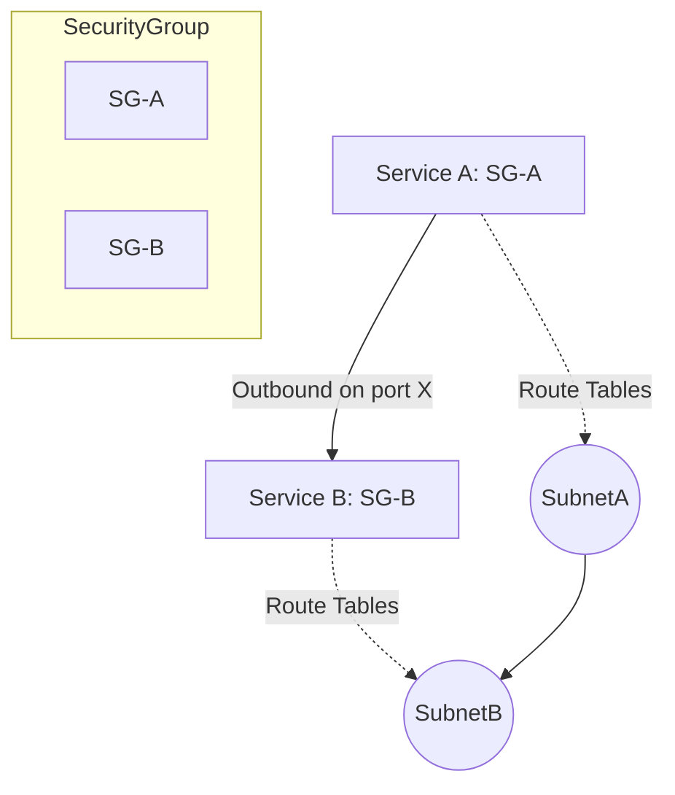

# Executive Summary  
The following 20 scenarios cover core DevOps topics (cloud operations, CI/CD, IaC, monitoring, security, networking, containers, cost, incident response, etc.) and reflect what a 4-year DevOps engineer might face. Key themes include troubleshooting under pressure, designing robust CI/CD pipelines, automating infrastructure, observing systems for performance and cost, enforcing security best practices, and planning for failures or attacks.  The scenarios require methodical problem-solving, strong AWS service knowledge (e.g. EC2/ASG, S3, CloudWatch, CodePipeline, IAM, VPC, EKS/ECS, RDS, Lambda, Route 53), and familiarity with DevOps tools (Terraform, Jenkins/GitHub Actions, Docker).  Top assessed skills include *analytical reasoning*, *automation using IaC and scripts*, *system reliability and recovery planning*, *security mindset*, *network/DNS troubleshooting*, and *cost-awareness*. The model answers cite AWS best practices and docs, and emphasize production-ready solutions and trade-offs【3†L169-L176】【28†L60-L67】.  

## Scenario 1: High CPU Utilization on Production Web Servers  
**Problem:** At 2 AM, EC2 web servers in a production Auto Scaling Group (ASG) hit >90% CPU. Users face timeouts.  
**Approach:**  
1. **Stabilize:** Quickly increase the ASG desired capacity (via console or `aws autoscaling set-desired-capacity`) to spin up new instances and absorb load【28†L60-L67】. This is a *tactical* mitigation to restore service.  
2. **Inspect Metrics:** In CloudWatch, check the **CPUUtilization** and **StatusCheckFailed** metrics for all instances【28†L60-L67】. Determine if instances are healthy or failing health checks. Also examine ELB latency and request count.  
3. **Access an Instance:** Use AWS Systems Manager Session Manager (or EC2 Instance Connect) to open a shell on an affected instance (no SSH keys needed)【28†L60-L67】.  
4. **Identify Cause:** Run OS tools (`top`, `htop`, `vmstat`, `iostat`) to find the CPU-hogging process. Check application logs (e.g. via CloudWatch Logs or `/var/log/app.log`). Correlate with events (recent deployments, traffic surges, or malware like cryptominer).  
5. **Fix Root Cause:** Based on findings, act: e.g. kill a runaway process, roll back a bad deployment, throttle a spike, or scale a related component (database CPU). If it’s legitimate load, consider adding more capacity or caching.  
6. **Post-Mortem:** Once stabilized, analyze logs to prevent recurrence. Optionally enable CloudWatch alarms to auto-scale on CPU threshold in future.  

**Tools/Services:** EC2 Auto Scaling Group (for scaling), CloudWatch metrics and logs, AWS Systems Manager (Session Manager)【28†L60-L67】, Application Load Balancer (to distribute traffic), CloudWatch Alarms (for future automation). These are chosen because ASG and CloudWatch are AWS-recommended for reactive scaling and monitoring, and SSM lets you safely access instances without SSH keys.  
**Example Commands:** 
- `aws autoscaling set-desired-capacity --auto-scaling-group-name MyASG --desired-capacity 10`  
- `aws cloudwatch get-metric-statistics --metric-name CPUUtilization --namespace AWS/EC2 ...`  
- `aws ssm start-session --target <instance-id>` to open a session.  

**Trade-offs/Failure Modes:** Scaling up increases cost; if the root cause was e.g. a memory leak or infinite loop, new instances may quickly suffer too. Relying on reactive scaling can mask issues. Mitigations include rate-limiting, caching, or refactoring code. If the bottleneck is a shared resource (e.g. database), adding web servers won’t help, so you must scale or optimize the DB. Ensure CloudWatch alarms have reasonable thresholds to avoid flapping.  

**Follow-up Prompts:** What CloudWatch alarms or Auto Scaling policies would you set to preempt this? How would you handle if the database is the bottleneck? How to debug without SSM (if not available)?  

**Scoring:** A strong answer methodically stabilizes the service first (e.g. increase ASG capacity) while diagnosing in parallel (using CloudWatch and SSM)【28†L60-L67】. It mentions verifying health checks, checking logs, and distinguishes between quick fixes vs root-cause fixes. The best answers reference specific AWS tools (CloudWatch, SSM) and reasoning.  

## Scenario 2: AWS Cost Spike Investigation  
**Problem:** The monthly AWS bill unexpectedly jumped 300%. Finance is alarmed. Identify the cause.  
**Approach:**  
1. **Use Cost Explorer:** Open AWS Cost Explorer and compare the current versus previous month. Group costs by **Service** and by **Resource tags**. Look for spikes in EC2, Data Transfer, S3, or any unusual service【28†L90-L94】.  
2. **Pinpoint Resource:** Once a service is high, drill down. For EC2, check for forgotten On-Demand instances, underutilized ELBs, or runaway Auto Scaling. For S3, check if a bucket has grown unexpectedly or if many small objects triggered a burst in GET requests. For data transfer, use **VPC Flow Logs + Athena** or CloudWatch to see large outbound traffic.  
3. **Check Recent Changes:** Review CloudTrail or CloudWatch Events for recent infrastructure changes: e.g. new accounts, new deployments, a software bug that spun up resources, or unusually high traffic. Also check trusted advisor or billing alerts for insights.  
4. **Remediate:** Tag misused/unused resources (e.g. old dev EC2) and terminate or downsize them. Update S3 lifecycle to move infrequent data to Glacier. Put data-transfer-heavy services in same region to avoid inter-region charges. Enable S3 Intelligent Tiering or enable EFS infrequent access for rarely-used files.  
5. **Implement Alerts:** Set AWS Budgets with alerts or use Cost Anomaly Detection (machine learning) to get notified on future spikes【28†L100-L105】. Tag all resources for allocation.  

**Tools/Services:** AWS Cost Explorer and AWS Budgets (for analysis and future alerts), VPC Flow Logs + Athena or CloudWatch metrics, AWS Config / CloudTrail (for change history), AWS Trusted Advisor Cost checks. These allow identifying spend by service or by tag, querying transfer logs, and correlating usage with changes.  

**Example Commands/Snippets:** 
- `aws ce get-cost-and-usage --time-period Start=$(date -d "1 month ago" +%F),End=$(date +%F) --group-by Type=DIMENSION,Key=SERVICE`.  
- Use AWS CLI to list running EC2 instances: `aws ec2 describe-instances --filters Name=instance-state-name,Values=running`.  
- Example Terraform snippet to tag resources: 
   ```hcl
   resource "aws_instance" "app" {
     ...
     tags = { Environment = "prod" }
   }
   ```  

**Trade-offs/Failure Modes:** Frequent cost monitoring increases analysis overhead, and automatic downscaling could risk availability. Over-optimizing (e.g. using only Spot instances) may hurt reliability if not managed. Mis-tagging resources can hide issues. Mitigate by enforcing tagging via AWS Organizations IAM policies, using Savings Plans/Reserved Instances where appropriate, and running Rightsizing Recommendations (AWS Compute Optimizer).  

**Follow-up Prompts:** How would you automate cost alerts? What if the spike was due to a third-party SaaS (e.g. an API call surge)? How to distinguish between valid growth and waste?  

**Scoring:** Strong answers show a systematic investigation: start with Cost Explorer (grouped by service) to find the culprit【28†L90-L94】, then drill into resource-level usage. They reference AWS tools (Cost Explorer, Budgets) and preventive measures. Mentioning data-transfer costs and tagging or alerting sets distinguishes higher maturity.  

## Scenario 3: CI/CD Pipeline Failing in CodeDeploy Stop Script  
**Problem:** CodePipeline (using CodeDeploy to an EC2 ASG) fails during the `ApplicationStop` hook. Error: `scripts/application_stop.sh failed with exit code 1.`  
**Approach:**  
1. **Check Deployment Logs:** Go to the CodeDeploy console, find the failed deployment, and inspect the **lifecycle event logs**. The logs will show exact stderr from `application_stop.sh`【28†L126-L130】. Identify the specific error (e.g. permission denied, file not found, syntax error).  
2. **Validate the Script:** On one of the target EC2 instances (use SSM or SSH), manually run the failing script: `bash -x scripts/application_stop.sh`. This dry-run reveals any issues like missing files or commands. Check file paths in the script to ensure they exist on the new instance.  
3. **IAM Role & Permissions:** Ensure the instance’s IAM role (CodeDeploy Agent role) has necessary permissions to perform stop operations (e.g. `ec2:DescribeInstances`, `ecs:UpdateService`, or stop tasks)【28†L126-L130】. Adjust the role policy if needed.  
4. **Fix and Test:** Correct the script (e.g. path or command fix), improve error handling (e.g. exit only after successful stop), and then commit to a staging branch. Trigger the pipeline on a dev/staging environment to verify. Only then push fixes to production pipeline.  
5. **Improve Pipeline:** Add more logging or notifications. Optionally use **CodeBuild** in the pipeline to lint/test scripts before deploy. Use AWS Systems Manager Run Command or Parameter Store to manage script changes safely.  

**Tools/Services:** AWS CodeDeploy (for deployments and viewing logs), AWS Systems Manager (Run Command or Session Manager for remote troubleshooting), EC2 (ASG targets), IAM (ensure proper roles)【28†L126-L130】, CodePipeline (or Jenkins/GitHub Actions if using other CI). These allow you to see exact failures and test fixes without manual SSH.  

**Example Commands/Snippets:**  
- View CodeDeploy logs via CLI: `aws deploy list-deployment-instances --deployment-id <id>`.  
- Test script: `aws ssm send-command --document-name "AWS-RunShellScript" --targets "Key=instanceids,Values=i-123456" --parameters commands=["bash -x /scripts/application_stop.sh"]`.  
- CloudFormation snippet for IAM role with EC2 describe: 
  ```yaml
  Resources:
    CodeDeployInstanceRole:
      Type: AWS::IAM::Role
      Properties:
        Policies:
          - PolicyName: CD-Stop-Perms
            PolicyDocument:
              Statement:
                - Effect: Allow
                  Action: 
                    - "ec2:Describe*"
                    - "ecs:Describe*"
                  Resource: "*"
  ```  

**Trade-offs/Failure Modes:** Fixing scripts may cause downtime if redeployment is needed, so use a staged environment. Overly permissive IAM roles reduce security; use least-privilege. If the deployment logic is flawed (e.g. no rollback), you might bricked instances. Mitigate by enabling rollback triggers or using blue/green canaries for zero-downtime upgrades.  

**Follow-up Prompts:** How would you structure this pipeline to avoid partial failures in production? What monitoring/alerting would you add for deployment failures? How to handle script errors differently (e.g. graceful shutdown)?  

**Scoring:** Strong answers pinpoint the failure by reading CodeDeploy logs and manually testing the stop script【28†L126-L130】. They mention using SSM for remote commands, fixing IAM permissions, and validating in staging. Citing specific AWS tools and safeguards (rollback, testing) marks a thorough approach.  

## Scenario 4: Exposed AWS Credentials in Public Repo  
**Problem:** A developer accidentally pushed AWS IAM user keys (Access Key + Secret) to GitHub. These keys have been live for 6 hours. What do you do immediately?  
**Approach:**  
1. **Revoke Credentials:** Immediately deactivate or delete the exposed keys in IAM. Go to IAM console or use CLI: `aws iam update-access-key --user-name alice --access-key-id AKIA... --status Inactive` (or `delete-access-key`). If the keys belong to an IAM role, detach all policies or disable the role. This cuts off any ongoing misuse【28†L147-L150】.  
2. **Assessment via CloudTrail:** Use AWS CloudTrail logs to see if the compromised key was used. Query for events in the last 6 hours filtering by Access Key ID. This identifies if an attacker performed any actions (e.g. used S3, EC2, etc)【28†L154-L162】.  
3. **Remediate Impact:** If the attacker made changes, revert them. For example, if they spun up resources, terminate unauthorized EC2/AMI’s; if they accessed S3 data, review/rotate any affected secrets. Rotate related secrets (e.g. DB passwords) if the key had that access.  
4. **Notify Stakeholders:** Inform security and management of the breach. Consider if an incident response plan (with IR team) should be activated.  
5. **Prevent Recurrence:** Add automated scanning (e.g. GitHub secret scanning or `git-secrets` pre-commit hook) to catch credentials before push. Educate the team. Use AWS Secrets Manager or SSM Parameter Store for credentials so keys aren’t hard-coded. Enforce MFA on console access.  

**Tools/Services:** AWS IAM (revoke keys), AWS CloudTrail (audit usage)【28†L154-L162】, AWS Config (to detect secrets in code), AWS Secrets Manager or SSM Parameter Store (secure storage), GitHub automated secret scanning. These align with AWS security best practices (immediate key rotation and auditing).  

**Example Commands:**  
- Revoke key: `aws iam delete-access-key --user-name alice --access-key-id AKIA...`.  
- Query CloudTrail: 
   ```bash
   aws cloudtrail lookup-events \
     --lookup-attributes AttributeKey=AccessKeyId,AttributeValue=AKIA... \
     --start-time $(date -u -d '6 hours ago' +%FT%TZ) \
     --end-time $(date -u +%FT%TZ)
   ```  
- Terraform snippet to remove a key: 
   ```hcl
   resource "aws_iam_access_key" "exposed" {
     user = "alice"
     lifecycle {
       prevent_destroy = false
     }
     count = 0  # ensure it's destroyed
   }
   ```  

**Trade-offs/Failure Modes:** Deleting keys may break any legitimate processes using them. To mitigate, adopt roles and temporary credentials (via STS) rather than long-lived keys. If CloudTrail wasn’t enabled, investigation is harder; ensure it’s always on. Over-use of root or highly privileged keys worsens impact; enforce least-privilege policies.  

**Follow-up Prompts:** How would you detect such leaks proactively? What if the keys were AWS Root account keys? How to rotate secrets in a live system with minimal downtime?  

**Scoring:** A strong answer immediately revokes the keys (cutting off access) and then uses CloudTrail to audit usage【28†L154-L162】. It discusses both the incident response steps (revoke, investigate, remediate) and longer-term controls (using Secrets Manager, IAM best practices). Mentioning automated scanning and least-privilege shows proactivity.  

## Scenario 5: Terraform State Lock Stuck in CI/CD  
**Problem:** Terraform plan in CI/CD fails: it can’t acquire a lock on the S3 state (DynamoDB backend). Error says “another process is holding the lock.” How do you safely resolve this?  
**Approach:**  
1. **Investigate the Lock:** Go to the DynamoDB table used for state locking. Look at the lock item (it contains LockID and Info). Identify which process or pipeline job holds the lock (often the `Info` field shows a run ID)【8†L174-L183】.  
2. **Check Pipeline Status:** In your CI/CD system (Jenkins, CodePipeline, etc.), verify if any Terraform job is still running or hung. If a previous `apply` was interrupted (e.g. network drop, cancelled build), the lock may remain. Ensure no other `plan/apply` is in flight.  
3. **Force Unlock (if safe):** If you are certain no active Terraform is running, release the lock with `terraform force-unlock <LOCK_ID>`. Use caution: unlocking while an apply is truly in progress will corrupt state【8†L182-L190】. Coordinate with team if needed.  
4. **Re-run in Isolation:** After unlocking, re-run `terraform plan`. Consider using **workspaces** or isolated state (per-environment) to prevent collisions. Ensure your CI pipeline serializes Terraform (use a queue) or uses `terraform init -force-copy` appropriately.  
5. **Improve State Management:** Enable proper CI locking (e.g. use Terraform Cloud/Enterprise or GitLab integrated locking), or use remote backends with state versioning. Always have backups of state in S3.  

**Tools/Services:** Terraform CLI (with S3 backend and DynamoDB for locks), AWS DynamoDB (for locks)【8†L174-L183】, AWS S3 (state storage), CI/CD system orchestration (to avoid concurrent runs), AWS IAM (to set appropriate s3/dynamodb permissions). DynamoDB locking is an AWS pattern for safe Terraform state.  

**Example Commands:**  
- Check locks in DynamoDB (via AWS Console or CLI): `aws dynamodb get-item --table-name terraform-lock-table --key '{"LockID":{"S":"terraform.tfstate"}}'`.  
- Force unlock: `terraform force-unlock -force b6640dc5-1234-5678-9abc-1234abcdef`.  
- Terraform backend snippet: 
   ```hcl
   terraform {
     backend "s3" {
       bucket         = "my-terraform-state"
       key            = "prod.tfstate"
       region         = "us-east-1"
       dynamodb_table = "terraform-lock-table"
     }
   }
   ```  

**Trade-offs/Failure Modes:** Frequent force-unlocking risks corrupting state if misused. Manual unlocking is error-prone at scale. The pipeline may deadlock again if not serialized; consider switch to Terraform Cloud’s remote runs for automatic locking. If the S3 bucket or DynamoDB is accidentally deleted or changed, state could be lost—mitigate by versioning the S3 bucket and backing up state snapshots.  

**Follow-up Prompts:** How would you structure your pipelines to avoid manual lock issues (e.g., by using GitOps or Terraform Cloud)? What if the state file itself becomes corrupted?  

**Scoring:** The best answers explain that Terraform locks prevent state corruption and describe checking who holds the lock and only using `terraform force-unlock` when safe【8†L174-L183】. They mention ensuring no concurrent runs (e.g. serialized pipelines or workspaces) and AWS best practices (DynamoDB locks, S3 versioning). Safe CI design is a plus.  

## Scenario 6: Blue/Green Deployment Rollback  
**Problem:** You performed a blue/green deployment (with CodeDeploy) of a new version. Initially, health checks passed and traffic shifted, but then 5xx errors and high CPU occur on the new (green) instances. How do you roll back?  
**Approach:**  
1. **Immediate Rollback:** Use AWS CodeDeploy to initiate a rollback to the blue environment. Since the original blue instances are still running behind the ALB, shifting traffic back is quick and minimizes customer impact【8†L215-L223】.  
2. **Stop New Deploy:** Pause or cancel any further automated traffic shifts. CodeDeploy’s “rollback” action can revert Route 53 or ALB target group pointers to the blue instances.  
3. **Stabilize and Analyze:** With traffic on the known-good (blue) servers, investigate the green side: check application logs on green instances (CloudWatch Logs), and metrics (CPU, memory). Look for errors (e.g. dependency failures, misconfiguration, missing secrets) that caused the failure【8†L223-L231】.  
4. **Improve Health Checks:** Ensure your deployment’s health check is robust. For example, use a custom application-level ping (HTTP `/health` endpoint) in addition to the basic ALB health check. This could catch failures before routing real traffic.  
5. **Fix and Retest:** Identify and fix the issue in the green deployment (bug, configuration, resources). Test thoroughly in a staging environment or using the “Canary” shift before re-deploying to production.  

**Tools/Services:** AWS CodeDeploy or AWS CodePipeline (Blue/Green with ALB), Application Load Balancer (supports blue/green target groups), CloudWatch Logs/Metrics (for analysis)【8†L215-L223】, Route 53 failover (if used), AWS Lambda (for custom rollback triggers). AWS CodeDeploy’s blue/green mode is chosen for safe rollback capability【16†L23-L31】.  

**Example Diagram:**  
```mermaid
flowchart LR
  subgraph Primary Region
    ALB_blue[ALB (blue)] --> Instances_blue[ASG: Blue Instances]
    Instances_blue --> RDS_primary[(RDS Primary)]
  end
  subgraph Green Environment
    ALB_green[ALB (green)] --> Instances_green[ASG: Green Instances]
    Instances_green --> RDS_primary
  end
  Route53 --> ALB_blue
  Route53 -.-> ALB_green
  Note1[Initial: Route53 -> Blue] 
  Note2[Shift: Route53 -> Green then Rollback -> Blue]
```  

**Trade-offs/Failure Modes:** Rolling back may still expose end users to some errors if not instantaneous; always confirm health of blue before redirecting. If the root cause is transient (e.g. a spike), a pause might suffice instead. Blue/green requires double infrastructure, so higher cost. Automated rollback via CodeDeploy may fail if the environment was changed or if DNS TTL is high; account for DNS caching or use short TTLs in Route 53.  

**Follow-up Prompts:** How would you design canary deployments instead of all-at-once? What if the issue happens only under heavy load? How to handle database migrations in a blue/green?  

**Scoring:** A strong answer notes that in blue/green the original environment can be restored instantly by rerouting traffic (rollback)【8†L215-L223】. It highlights examining logs and metrics on the failed release, and improving health checks. Mentioning CodeDeploy’s built-in rollback and deployment configurations (canary/linear)【16†L23-L31】 shows understanding of AWS deployment strategies.  

## Scenario 7: ECS Fargate Logs Suddenly Stop  
**Problem:** An application on AWS ECS Fargate was sending logs to CloudWatch, but logging has stopped abruptly even though the app is running. How do you troubleshoot?  
**Approach:**  
1. **Check IAM Role:** Verify that the ECS task execution role has the correct CloudWatch permissions (`logs:CreateLogStream`, `logs:PutLogEvents`)【20†L489-L492】. A permissions change or missing policy will block log delivery.  
2. **Inspect Task Definition:** Ensure the log configuration (`awslogs` driver or FireLens) is correct. Confirm the `logConfiguration` in the task definition has the right `logGroup` and `region`. A typo in the log group name or wrong region will cause logs to silently drop.  
3. **Verify Log Group Exists:** In CloudWatch Logs, check that the specified log group exists. If not, either create it or enable auto-creation. A missing log group often stops logs (per AWS guidance【20†L489-L492】).  
4. **Check for Task Failures:** Use `aws ecs describe-tasks` or ECS Console to see recent task stops/restarts. Sometimes the container might crash (e.g. `ResourceInitializationError: unable to pull secrets`), in which case no logs appear.  
5. **Check CloudWatch Quotas:** Ensure CloudWatch Logs quotas are not exceeded (log group count or ingestion rate). Although rare, exceeding quotas can drop logs.  
6. **Network Considerations:** If using a VPC without Internet/NAT, ensure a VPC endpoint for CloudWatch Logs exists, or that NAT allows traffic to logs.  

**Tools/Services:** AWS ECS/EKS (Fargate tasks), AWS CloudWatch Logs (for log ingestion), IAM (task execution role)【20†L489-L492】, AWS VPC (endpoints), AWS Systems Manager (for remote exec, if needed). The OneUptime guide notes missing CloudWatch logs often stem from IAM or missing log groups【20†L489-L492】.  

**Example Commands:**  
- Check permissions: `aws iam get-role-policy --role-name ecsTaskExecutionRole --policy-name AmazonECSTaskExecutionRolePolicy`.  
- Check stopped tasks: 
   ```bash
   aws ecs list-tasks --cluster my-cluster --desired-status STOPPED \
     | xargs -n1 aws ecs describe-tasks --cluster my-cluster --tasks
   ```  
- Sample Task Definition snippet: 
   ```json
   "logConfiguration": {
     "logDriver": "awslogs",
     "options": {
       "awslogs-group": "/ecs/my-service",
       "awslogs-region": "us-east-1",
       "awslogs-stream-prefix": "ecs"
     }
   }
   ```  

**Trade-offs/Failure Modes:** If you re-enable logs incorrectly (wrong role), you could leak logs or cause high costs. Be careful when creating log groups (retention settings). A task restarting too fast might hide logs; adjust health checks or restart policy. Always test logging in a dev environment.  

**Follow-up Prompts:** How would you set up centralized logging for multiple services? What if your tasks were on EC2 instead of Fargate? How to ensure log delivery in case of VPC outages?  

**Scoring:** The best answers check IAM and log configuration first (the usual culprits)【20†L489-L492】. They mention verifying the execution role and log group existence, and consider network/VPC endpoint issues. Referencing CloudWatch log settings and quotas shows depth.  

## Scenario 8: Slow RDS Database Performance  
**Problem:** Your app’s Amazon RDS (PostgreSQL) instance has high CPU and read latency. How do you diagnose and fix the performance bottleneck?  
**Approach:**  
1. **Use Performance Insights:** Enable and review Amazon RDS Performance Insights. It provides a dashboard of database load by query【22†L52-L60】. Identify which SQL statements or waits are causing the most load.  
2. **Analyze Slow Queries:** For any high-latency query, run `EXPLAIN ANALYZE` (via psql or a client) to see if it’s doing a sequential scan or waiting on locks. Often a missing index causes full table scans.  
3. **Optimize Schema/Indexes:** If a query is slow due to no index on a join/WHERE column, create the appropriate index. For example, `CREATE INDEX idx_users_email ON users(email);` can turn a seq scan into an index seek.  
4. **Scale/Offload:** If queries are already optimized but load is high, scale the instance (CPU/memory) or add a Read Replica to offload read traffic. In PostgreSQL, you can promote a read replica in a failover.  
5. **Review Resource Allocation:** Ensure your RDS instance class is appropriate (e.g., not a T2 burstable if CPU is constantly high). Check connection usage (max_connections) and add indexing or caching layers (ElastiCache) if needed.  

**Tools/Services:** Amazon RDS Performance Insights and CloudWatch (for metrics), AWS DMS (if migrating), Amazon ElastiCache (for caching), EXPLAIN ANALYZE on queries. Performance Insights is designed to identify bottlenecks and slow queries【22†L52-L60】.  
 
**Example Commands:**  
- Query Performance Insights: (via AWS Console) select the DB, choose “Top SQL queries”.  
- Example SQL analysis:  
  ```sql
  EXPLAIN ANALYZE SELECT * FROM orders WHERE customer_id = 123;
  ```  
- Terraform to add read replicas: 
  ```hcl
  resource "aws_db_instance" "reporting" {
    ...
    replicate_source_db = aws_db_instance.primary.id
    instance_class     = "db.m5.large"
  }
  ```  

**Trade-offs/Failure Modes:** Adding too many indexes speeds reads but slows writes and uses more storage. Over-scaling increases cost. Caching can reduce load but adds complexity (cache invalidation). If a rogue query floods CPU, consider query throttling or killing the session. Always test schema changes in staging before production.  

**Follow-up Prompts:** How would you handle a migration if scaling isn’t enough? What metrics (beyond CPU) would you watch for DB load? How to ensure schema changes don’t lock tables?  

**Scoring:** The strongest answers cite Performance Insights for bottleneck identification【22†L52-L60】 and mention using EXPLAIN ANALYZE to pinpoint slow queries. They discuss index creation vs write overhead, read replicas, and instance sizing. Showing understanding of database internals and AWS monitoring tools is key.  

## Scenario 9: Private Subnet Connectivity Issue  
**Problem:** Two new microservices (A and B) in different private subnets (on ECS Fargate) cannot communicate. Service A’s task is up, but calls to Service B time out. How do you debug this network issue?  
**Approach:**  
1. **Security Groups:** Check the Security Group on Service B (target). It must allow inbound traffic on the service port from Service A’s SG (or CIDR). Likewise, Service A’s SG must allow outbound to Service B’s port【25†L302-L310】. Best practice: reference SG IDs, not wide IP ranges.  
2. **Network ACLs:** Ensure the subnets’ Network ACLs allow the traffic. By default they do, but confirm both directions (allow ephemeral ports 1024-65535 for return traffic)【25†L302-L310】.  
3. **Route Tables:** Verify that both subnets’ route tables are correct (no missing routes) and that they belong to the same VPC or a VPC peering/TGW that connects them.  
4. **VPC Reachability Analyzer:** Use VPC Reachability Analyzer (AWS console) to create a path test between the ENI (elastic network interface) of Service A and Service B【25†L302-L310】. This tool will report if the path is blocked by SG, NACL, or missing route.  
5. **DNS and Service Discovery:** If Service B is accessed by DNS name, ensure that the DNS resolves to the correct internal IP (Amazon ECS tasks can use AWS Cloud Map or just AWS Service Discovery). Verify the correct DNS or endpoint.  

**Tools/Services:** VPC Security Groups and NACLs (the likely culprits)【25†L302-L310】, AWS VPC Reachability Analyzer, AWS CloudWatch logs (for any Connect errors), AWS Route 53 or ECS Service Discovery for DNS. AWS recommends checking SGs first in connectivity issues.  

**Example Flowchart:**  


**Trade-offs/Failure Modes:** Opening SGs too broadly can expose services; always restrict to needed ports and sources. Misconfigured NACLs can block return traffic silently. If the services scale to new subnets, ensure SG references apply to all. If using public load balancers by mistake, traffic may not route internally as expected.  

**Follow-up Prompts:** What if the services were in different AWS accounts or VPCs? How would you secure service-to-service traffic further (e.g. with a Service Mesh)? How to handle cross-zone DNS latency?  

**Scoring:** Strong answers methodically eliminate each layer: SGs, NACLs, routes, and use the VPC Reachability Analyzer【25†L302-L310】 to pinpoint blocks. They explicitly mention port rules (including ephemeral ports) and AWS-recommended tooling. Citing SG-ID referencing best practices differentiates high-scoring answers.  

## Scenario 10: Designing Multi-Region DR for 15 min RTO/RPO  
**Problem:** Business demands RTO ≤15 minutes and RPO ≤5 minutes for the e-commerce app. Architect a multi-region AWS DR solution.  
**Approach:**  
1. **Active/Active or Warm Standby:** Given the tight RPO (5 min), Active-Active or warm standby is needed. For RTO 15 min, pilot-light (cold data) won’t suffice. We’ll maintain ready infrastructure in a secondary region.  
2. **Route 53 Failover:** Use Amazon Route 53 with health checks and a failover routing policy. Normally route traffic to the primary region endpoints; upon detection of failure, switch all traffic to the secondary. DNS TTLs should be low.  
3. **Data Replication:**  
   - **Databases:** For the primary RDS (e.g. Aurora or RDS), enable cross-region read replicas (for MySQL/Postgres/Aurora)【25†L324-L332】. In a failover, promote the replica to primary. For DynamoDB, use Global Tables to auto-replicate writes to the secondary region synchronously【25†L330-L334】.  
   - **Static Assets:** Enable S3 Cross-Region Replication so any file uploaded to the primary bucket is copied to the secondary. Use versioning for safety.  
   - **Sessions/Cache:** Store session state in DynamoDB Global Tables or ElastiCache with backup/replication.  
4. **Keep Standby Up-to-Date:** Use CI/CD pipelines to deploy application stacks to both regions (Infrastructure as Code). Optionally keep the secondary scaled down (warm) but can auto-scale up if traffic shifts. Use CloudWatch alarms in primary to trigger automatic failover (via Lambda updating Route 53)【25†L334-L339】.  
5. **Regular Testing:** Regularly test failover by simulating outages (e.g. Route 53 switchover, AWS Fault Injection Simulator) to validate RTO/RPO. Ensure data consistency after failover by checking that latest writes (within 5 min) are present.  

**Tools/Services:** Amazon Route 53 (for DNS failover), AWS Lambda (to automate failover), RDS/Aurora Cross-Region Replicas, DynamoDB Global Tables, S3 Cross-Region Replication【25†L324-L332】, CloudWatch Alarms (to detect outages), CI/CD (to replicate deployments). This design meets RTO/RPO by keeping standby infrastructure and data nearly in sync.  

**Example Diagram:**  
```mermaid
graph LR
  subgraph Primary Region
    ALB_Primary(ALB) --> AppPrimary[EC2/ECS Instances]
    AppPrimary --> RDS_Primary[(RDS Primary)]
    AppPrimary --> S3_Primary[(S3)]
  end
  subgraph Secondary Region (Standby)
    ALB_Secondary(ALB) --> AppSecondary[EC2/ECS Instances]
    AppSecondary --> RDS_Replica[(RDS Replica)]
    AppSecondary --> S3_Replica[(S3 Replica)]
  end
  CloudFront -.-> Route53[Route 53 DNS] -.-> ALB_Primary
  Route53 -.-> ALB_Secondary
  RDS_Primary -- Cross-region Read Replica --> RDS_Replica
  S3_Primary -- CRR --> S3_Replica
  DynamoDB_Primary((DynamoDB Global Table Primary)) --Replicate--> DynamoDB_Secondary((DynamoDB Global Table Secondary))
```  

**Trade-offs/Failure Modes:** Active-active or warm standby is costly (duplicate resources) compared to pilot-light. Replication can lag; AWS offers enhanced replication (Global Tables). DNS failover can be delayed by caching. Network partitions may cause split-brain if not careful; use health checks on both sides. Mitigate by carefully configuring Route 53 health checks and by decoupling using SNS/SQS for cross-region notifications.  

**Follow-up Prompts:** Why not use Multi-AZ within a single region for this requirement? How does the design change if RPO were 0 (no data loss)? How to handle file system or EBS data?  

**Scoring:** High-scoring answers propose active-passive or active-active multi-region design with Route 53 failover【25†L324-L332】, covering cross-region replication (RDS, S3, DynamoDB) and automated failover. Mentioning infrastructure-as-code to keep standby up-to-date and regular drill tests shows thorough planning for reliability.  

---

*The above scenarios illustrate mid-level DevOps responsibilities on AWS, emphasizing a systematic approach, AWS best practices, and an awareness of trade-offs and failure modes. Strong responses use specific AWS services (as cited) and demonstrate an end-to-end solution mindset.*
